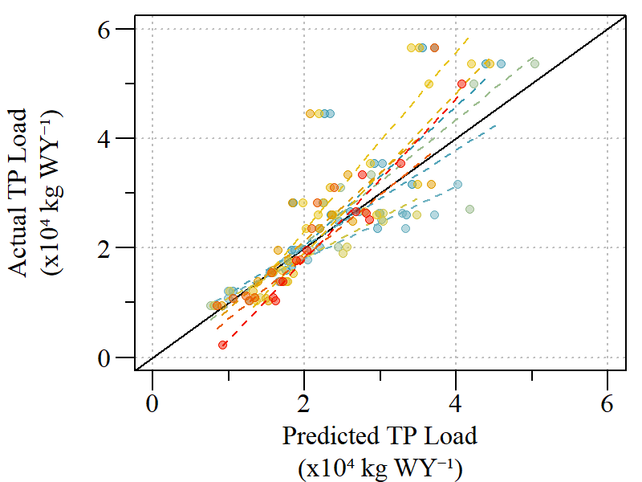
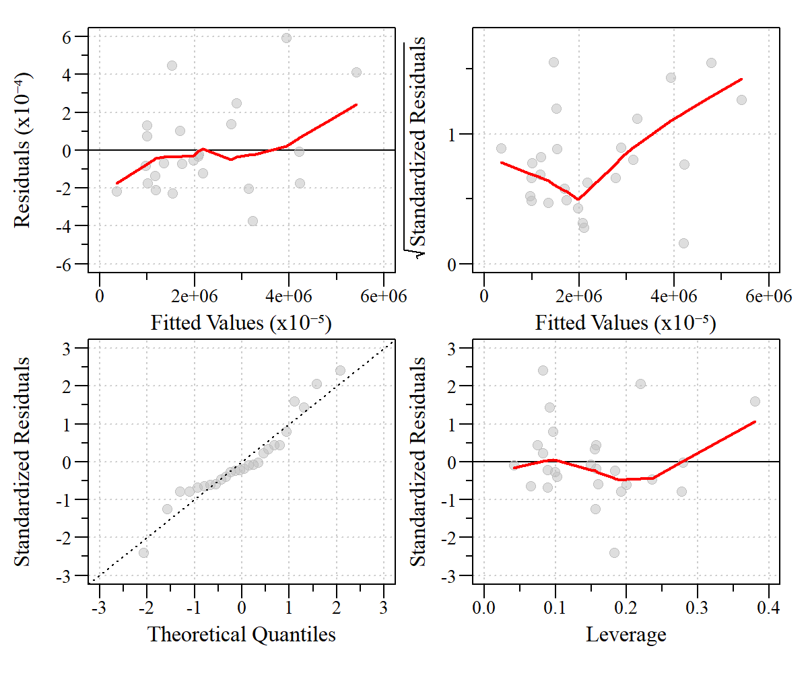

```{r setup, include=FALSE}
library(knitr)
library(fontawesome)

library(flextable)
library(magrittr)

options(htmltools.dir.version = FALSE)
knitr::opts_chunk$set(warning = FALSE, message = FALSE, echo=FALSE)

library(reshape)

## Paths
wd="C:/Julian_LaCie/_Github/LOSOM_ENLM"

paths=paste0(wd,c("/resources/","/Export/","/Data/"))
# Folder.Maker(paths);#One and done. Creates folders in working directory.
plot.path=paths[1]
export.path=paths[2]
data.path=paths[3]

## Functions
notidy_glance_lm=function(model,...){
  # check whether the model was fitted with only an intercept, in which
  # case drop the fstatistic related columns
  int_only <- nrow(summary(model)$coefficients) == 1
  
  with(
    summary(model),
    data.frame(
      r.squared = r.squared,
      adj.r.squared = adj.r.squared,
      sigma = sigma,
      statistic = if (!int_only) {fstatistic["value"]} else {NA},
      p.value = if (!int_only) {
        pf(
          fstatistic["value"],
          fstatistic["numdf"],
          fstatistic["dendf"],
          lower.tail = FALSE
        )
      } else {NA},
      df = if (!int_only) {fstatistic["numdf"]} else {NA},
      logLik = as.numeric(stats::logLik(model)),
      AIC = stats::AIC(model),
      BIC = stats::BIC(model),
      deviance = stats::deviance(model),
      df.residual = df.residual(model),
      nobs = stats::nobs(model)
    )
  )
}

notidy_tidy_lm <- function(model, conf.int = FALSE, conf.level = 0.95, ...) {
  
  ret <- data.frame(summary(model)$coefficients)
  ret$term<-rownames(ret)
  rownames(ret)=NULL
  ret<-ret[,c(5,1:4)]
  colnames(ret) <- c("term", "estimate", "std.error", "statistic", "p.value")
  
  if(conf.int){
    ci <- confint(model,level=conf.level)
    ci <- data.frame(ci)
    ci$term<-rownames(ci)
    rownames(ci)=NULL
    ci<-ci[,c(3,1,2)]
    names(ci)<- c("term","conf.low","conf.high")
    
    ret<-merge(ret,ci,"term")
  }
  ret
}

# data_t=notidy_tidy_lm(mod.TN)
# data_g=notidy_glance_lm(mod.TN)

notidy_as_flextable<-function(x,data_t=NULL,data_g=NULL,dig.num=2,sigma.form="d",r2dig=2,alpha.val=0.01,sig.code=FALSE,...){
 # needs flextable

    pvalue_format <- function(x){
    z <- cut(x, breaks = c(-Inf, 0.001, 0.01, 0.05, 0.1, Inf), labels = c("***", "**", "*", ".", ""))
    as.character(z)
    }
  
  if(class(x)=="lm"&is.null(data_t)&is.null(data_g)){
  data_t <- notidy_tidy_lm(x)
  data_g <- notidy_glance_lm(x)
  }
  
  if(sig.code==TRUE){
    ft <- flextable(data_t, col_keys = c("term", "estimate", "std.error", "statistic", "p.value", "signif"))
    ft <- colformat_num(ft, j = c("estimate", "std.error", "statistic"), digits = dig.num)
    ft <- colformat_num(ft, j = c("p.value"), digits = dig.num)
    ft <- compose(ft, j = "signif", value = as_paragraph(pvalue_format(p.value)) )
    ft <- set_header_labels(ft, term = "", estimate = "Estimate",
                          std.error = "Standard Error", statistic = "t-value",
                          p.value = "\u03C1-value", signif = "" )
    dimpretty <- dim_pretty(ft, part = "all")
  
  ft <- add_footer_lines(ft, values = c(
    "Signif. codes: 0 \u2264 '***' < 0.001 < '**' < 0.01 < '*' < 0.05 < '.' < 0.1 < ' ' < 1",
    "",
    sprintf("Residual standard error: %s on %.0f degrees of freedom", formatC(data_g$sigma,format=sigma.form), data_g$df.residual),
    sprintf("Multiple R-squared: %s, Adjusted R-squared: %s", formatC(data_g$r.squared,digits = r2dig,format="f"), formatC(data_g$adj.r.squared,digits = r2dig,format="f")),
     paste0("F-statistic: ",formatC(data_g$statistic)," on ",data_g$df.residual, " and ",data_g$df, ", \u03C1-value:",ifelse(data_g$p.value<alpha.val,paste("\u2264",alpha.val),format(round(p.value,2),nsmall=2)))
  ))
  }else{
    data_t$p.value<-with(data_t,ifelse(p.value<=alpha.val,paste0("\u2264 ",alpha.val),format(round(p.value,2),nsmall=2))) 
    data_g$p.value<-with(data_g,ifelse(p.value<=alpha.val,paste0("\u2264 ",alpha.val),format(round(p.value,2),nsmall=2)))
    
    ft <- flextable(data_t, col_keys = c("term", "estimate", "std.error", "statistic", "p.value", "signif"))
    ft <- colformat_num(ft, j = c("estimate", "std.error", "statistic"), digits = dig.num)
    # ft <- colformat_num(ft, j = c("p.value"), digits = dig.num)
    ft <- set_header_labels(ft, term = "", estimate = "Estimate",
                          std.error = "Standard Error", statistic = "t-value",
                          p.value = "\u03C1-value", signif = "" )
    dimpretty <- dim_pretty(ft, part = "all")
  
  ft <- add_footer_lines(ft, values = c(
    "",
    sprintf("Residual standard error: %s on %.0f degrees of freedom", formatC(data_g$sigma,format=sigma.form), data_g$df.residual),
    sprintf("Multiple R-squared: %s, Adjusted R-squared: %s", formatC(data_g$r.squared,digits = r2dig,format="f"), formatC(data_g$adj.r.squared,digits = r2dig,format="f")),
    paste0("F-statistic: ",formatC(data_g$statistic)," on ",data_g$df.residual, " and ",data_g$df, ", \u03C1-value: ",data_g$p.value)
    ))
  }
  ft <- align(ft,j=5,align="right")
  ft <- align(ft,j=5,align="right",part="all")
  ft <- align(ft, i = 1, align = "right", part = "footer")
  ft <- italic(ft, i = 1, italic = TRUE, part = "footer")
  ft <- hrule(ft, rule = "auto")
  ft <- autofit(ft, part = c("header", "body"))
  ft
}

```

layout: true

<div class="my-footer">
<span>DRAFT</span>
</div>

<!-- this adds the link footer to all slides, depends on my-footer class in css-->
<!-- used https://arm.rbind.io/slides/xaringan.html to help build this presentation --->
<!--
```{r xaringan-logo, echo=FALSE}
#xaringanExtra::use_logo(
#  image_url = "D:/__logo/SWE_logo.png"
#)
```
--->

---
name: xaringan-title
class: left, middle

### Lake Okeechobee System Operating Manual<br>(WQ Subteam)

#### .fancy[DRAFT - Caloosahatchee River Estuary Nutrient Loading Model]

#### <font color="red"> Addendum to [2020-09-18 presentation](https://owper-tech.github.io/slides/LOSOM/ENLM/Julian_LOSOM_ENLM#1), response to comments</font>


FDEP - Office of Water Policy and Ecosystem Restoration

`r format(as.Date(Sys.Date()),"%B %d, %Y")`

<!-- this ends up being the title slide since seal = FALSE-->

???
- Answer to comments provided during meeting and post-meeting comments 


---
name: questions

#### General Comments

Link to [2020-09-18 presentation](https://owper-tech.github.io/slides/LOSOM/ENLM/Julian_LOSOM_ENLM#1).

General comments on FDEP presentation dated 9/18/2020

The use of water quality models for LOSOM evaluations:

* What do models look like with hurricane years included?

*	Is modeling necessary since historical data exist and can be applied to the flow values that will be simulated during the LOSOM evaluations?

* Models are inaccurate and tend to estimate values closer to averages than to extremes - which occur in real life – and have a significant effect on water quality.


<!--
Comments on FDEP presentation  dated 9/18/2020 recieved from Gary Goforth

The use of water quality models for LOSOM evaluations:

1.	Is unnecessary since historical data exist and can be applied to the flow values that will be simulated during the LOSOM evaluations.

2.	Is inaccurate and tends to estimate values closer to averages than to extremes - which occur in real life – and have a significant effect on water quality.

3.	Leads to a waste of time as people argue over the models; particularly a model from FDEP – the people who mislead the public annually using their erroneous BMAP models and claiming that water quality is significantly better than it really is (compared to measured data).
--->

???
other comments from Goforth
Also: 
1.	Why did FDEP ignore the St Lucie Estuary?
 - Response: If attended presentation you would have this information, St Lucie models are currently under developement.
2.	Why did FDEP ignore the public health and safety impacts of lake discharges to the estuaries that contain toxic blue green algae?
 - Response: was not the emphasis of the presentation/work.
3.	FDEP arbitrarily excluded years with major hurricanes – 9 years out of a 38-year data set – almost 25% of the period of record.  They actually assume that hurricanes don’t happen and don’t affect water quality – not surprised by this absurd assumption from FDEP.  If their models can’t handle the realty of hurricanes then they should abandon the models and rely on historical data.
 - Response: Models were developed to estimate water quality based on system operations. Response to hurricane the system is generally operated in a different manner (quickly to make storage available for run-off)
4.	There was no mention of TP and TN TMDLs for the estuaries.
 - Response: TMDLs are a seperate process and require specifics 
5.	There was no mention of how the model will be used during LOSOM evaluations.
 - Response: Discussed during presentation
6.	The model ignores total suspended sediment which causes significant damages to the estuaries, e.g., smothers seagrasses.
 - Response: CRE estuary is light limited more from CDOM than particulate


---

#### Model Comparisons

<!-- Idea from Beck MW, Murphy RR (2017) Numerical and Qualitative Contrasts of Two Statistical Models for Water Quality Change in Tidal Waters. JAWRA Journal of the American Water Resources Association 53:197–219. --> 

<!-- https://stats.stackexchange.com/questions/110999/r-confused-on-residual-terminology -->

Absolute and Relative measures of error were used to compare models. 

- Absolute error - Root Mean Square Error (RMSE) or Residual Residual Standard error (RSE or $\sigma$)

- Relative error - coefficient of determination ( $R^{2}$)

.pull-left[

.small[
Root Mean Square Error (RMSE) 

\begin{align*}
RMSE = \sqrt{ \frac{\sum_{i=1}^{n}( X_{i} - \hat{X_{i}} )^{2} }{n} }
\end{align*}


Residual Standard error (RSE)

\begin{align*}
RSE = \sqrt{ \frac{\sum_{i=1}^{n}( X_{i} - \hat{X_{i}} )^{2} }{df} }
\end{align*}

.small[
$X_{i}$: Oberseved value

$\hat{X_{i}}$: Predicted value

$n$: Number of observations 

$df$: Model residual degrees of freedom
]

* Values closer to zero represent model prediction closer to observed.
]
]

.pull-right[

.small[
$R^{2}$

\begin{align*}
R^{2} = 1- { \frac{RSS}{TSS} }
\end{align*}

Adjusted $R^{2}$ ( $R^{2}_{adj.}$ )

\begin{align*}
R^{2}_{adj.} = 1- \left[{ \frac{(1-R^{2})(n-1)}{n-K-1} }\right]
\end{align*}

.small[

$RSS$: Residual sum of squares

$TSS$: Total sum of squares

$n$: Number of observations

$K$: Kumber of variables

]

* Represents the proportion of the variance explained by the model.

]
]

<!--
Root Mean Square Difference (RMSD)

\begin{align*}
RMSD = \sqrt{ \frac{\sum_{i=1}^{n}( \hat{X_{A,i}} - \hat{X_{B,i}} )^{2} }{n} }
\end{align*}

Where:

$\hat{X_{A}}$ and $\hat{X_{B}}$ model estimates for each model


- Average difference (or bias) of predictions between models as a percentage was estimated.
-->


???
RSME different from Residual Standard error (sigma)

`sqrt( sum(residuals(fit)^2) / fit$df.residual ) `


R2 assumes that every single variable explains the variation in the dependent variable. The adjusted R2 tells you the percentage of variation explained by only the independent variables that actually affect the dependent variable.

---

#### Inclusion vs Exclusion of Hurricane Years

\begin{align*}
TP Load_{S79} = Q_{C43 Basin} +  Q_{S77} + Mean  Lake  Stage
\end{align*}

- Data error in initally presented model

- No data transformations needed, and fit the assumptions of the statistical test

- Model Fit Summary:


```{r}
mod.est=read.csv(paste0(export.path,"model_estimates.csv"))
mod.sum=read.csv(paste0(export.path,"model_summary.csv"))
mod.sum$DF.f=with(mod.sum,paste(df,df.residual,sep=", "))

TP.mod.sum=subset(mod.sum,response=="TPLoad")
vars=c("r.squared", "adj.r.squared", "sigma", "statistic", "p.value", 
"df","df.residual","nobs","note")
TP.mod.sum=data.frame(cast(melt(TP.mod.sum[,vars],id.vars="note"),note~variable,value="value"))
TP.mod.sum[,c(2:3,5)]=round(TP.mod.sum[,c(2:3,5)],2)
TP.mod.sum$sigma=round(TP.mod.sum$sigma,0)
TP.mod.sum$p.value=with(TP.mod.sum,ifelse(p.value<0.01,"<0.01",ifelse(p.value<0.05,"<0.05",round(p.value,2))))
TP.mod.sum$DF.f=with(TP.mod.sum,paste(df,df.residual,sep=", "))
vars2=c("note","r.squared", "adj.r.squared", "sigma", "statistic", "p.value", 
"DF.f","nobs")

cap.val="Model fit statistics for the S-79 total phosphorus load models using all available data and excluding hurricane years."
TP.mod.sum=TP.mod.sum[,vars2]
flextable(TP.mod.sum)%>%
  fontsize(size=13,part="header")%>%
  fontsize(size=11,part="body")%>%
  font(fontname="Arial",part="all")%>%
  align(j=2:ncol(TP.mod.sum),align="center",part="all")%>%
  hline_top(border = officer::fp_border(width = 1.25))%>%
  hline_bottom(border = officer::fp_border(width = 1.25))%>%
  compose(i=1,j=1,as_paragraph("All Data"))%>%
  compose(i=2,j=1,as_paragraph("Hurricane Years Excluded"))%>%
  set_header_labels("note"="Model","r.squared"="R\u00B2", 
                    "adj.r.squared"="Adj R\u00B2",
                    "sigma"="\u03C3", 
                    "statistic"="F-Statistic", 
                    "p.value"="\u03C1-value","DF.f"="DOF\n(Model, Residuals)","nobs"="Observations")%>%
  width(width=c(2,0.8,0.8,0.8,1,0.8,2,1.2))%>%
  height(height=0.25)%>%
  footnote(i=1,j=1,part="header",
           value=as_paragraph(" Total Phosphorus Load Model (WY1982 - 2019)"),
           ref_symbols = c("a"))%>%
  footnote(i=1,j=4,part="header",
           value=as_paragraph(" \u03C3 = Residual Standard Error"),
           ref_symbols=c("b"))%>%
  footnote(i=1,j=4,part="header",
           value=as_paragraph("Models based on 70:30 train:test approach"),
           ref_symbols=c(" "))%>%
  add_header_lines(values=cap.val)%>%fontsize(size=13,part="header")
  #add_header(note=cap.val,r.squared=cap.val,adj.r.squared=cap.val,sigma=cap.val,statistic=cap.val,
  #           p.value=cap.val,DF.f=cap.val,nobs=cap.val,top=T)%>%
  #merge_h(part="header")
  

```

<!--
- Ususally models are selected based on AIC, AICc or BIC values but due ot inconsistent degrees of freedom this is not possible.
  - But we can select models based on relative ( $R^{2}$ ) and absolute ( $\sigma$ ) model fit.
-->

---
name: S79TPMod
#### Inclusion vs Exclusion of Hurricane Years

\begin{align*}
TP Load_{S79} = Q_{C43 Basin} +  Q_{S77} + Mean  Lake  Stage
\end{align*}

- Final Model

```{r}
cap.val="S-79 total phosphorus model results and estimates fitted using all available data during the water year 1982 - 2019 period."
notidy_as_flextable(x=NULL,data_g=subset(mod.sum,response=="TPLoad"&note=="all-data"),
                    data_t=subset(mod.est,response=="TPLoad"&note=="all-data"))%>%
  compose(i=2,j=1,as_paragraph("Q",as_sub("C43")))%>%
  compose(i=3,j=1,as_paragraph("Q",as_sub("S77")))%>%
  compose(i=4,j=1,as_paragraph("Mean Lake Stage"))%>%
  width(width=c(1.5,1.2,1.2,1.2,1.2,0.1))%>%
  fontsize(size=13,part="header")%>%
  fontsize(size=11,part="body")%>%
  align(j=2:5,align="center",part="all")%>%
  add_header_lines(values=cap.val)%>%fontsize(size=13,part="header")


```


\begin{align*}
TP Load_{S79} = 127156 + 0.20 Q_{C43 Basin} + 0.08 Q_{S77} - 7689 Mean  Lake  Stage
\end{align*}


.footnote[
.small[[Model Diagnostics](#TP_diag) plots]
]

---
name: S79TP_eval1
class: left

#### S-79 Water Quality Model (Total Phosphorus)

\begin{align*}
TP Load_{S79} = Q_{C43 Basin} +  Q_{S77} + Mean  Lake  Stage
\end{align*}


.pull-left[
```{r ,fig.align="center"}
knitr::include_graphics('./resources/C43TPLoad_WY_ActualPred.png')
```
Actual versus predicted TP loads at S-79 based on predictive model. Actual and predicted concentration were highly correlated (Spearman’s correlation: r=0.98, $\rho$<0.01).
]

--
.pull-right[

<br>

Model Fit
  - $R^{2}_{adj}$ : 0.78
  - RSE : 49112
  
Train:Test
  - Mean Absolute Percent Error: 15 %
  - Min-Max Accuracy: 87 %

]

???
Mean absolute percentage error - lower the better
Min_Max Accuracy - higher the better

---
name: S79TP_eval2
class: left

#### S-79 Water Quality Model (Total Phosphorus)

\begin{align*}
TP Load_{S79} = Q_{C43 Basin} +  Q_{S77} + Mean  Lake  Stage
\end{align*}


.pull-left[
```{r ,fig.align="center"}

```
Actual versus predicted TP loads at S-79 with each k-model presented. 
]

--
.pull-right[
k-fold (k=10)

_Cross-validation error (average k errors)_

```{r}
data.frame(source=c(rep("Model",2),rep("Train:Test",2)),Parameter=c("R2adj","RMSE","MAPE","MMA"),
           Mean=c(0.71,63461,21,83),
           Min=c(0.62,41657,16,78),
           Max=c(0.79,76864,41,86))%>%
  flextable()%>%
  font(fontname="Arial",part="all")%>%
  bold(part="header")%>%
  fontsize(size=13,part="header")%>%
  fontsize(size=11,part="body")%>%
  colformat_num(i=2:4,j=3:5,digits=0)%>%
  align(align="left",part="all")%>%
  align(j=3:5,align="center",part="all")%>%
  merge_v(j=1)%>%valign(j=1,valign="top")%>%
  compose(i=1,j=2,as_paragraph("R",as_sup("2"),as_sub("adj")))%>%
  width(width=c(1,1,1,1,1))%>%
  set_header_labels("source"=" ","Per.R2"="Percent of R\u00B2")%>%
  fix_border_issues()%>%
  footnote(i=3:4,j=2,part="body",
           value=as_paragraph(" Mean Absolute Percent Error (MAPE) and Min-Max Accuracy (MMA) expressed in percent"),
           ref_symbols = c(" 1"))

```


]


---

#### Inclusion vs Exclusion of Hurricane Years

\begin{align*}
TN Load_{S79} = Q_{C43 Basin} +  Q_{S77} + Mean  Lake  Stage
\end{align*}

- No data transformations needed, and fit the assumptions of the statistical test

- Model Fit Summary:

```{r}

TN.mod.sum=subset(mod.sum,response=="TNLoad")
vars=c("r.squared", "adj.r.squared", "sigma", "statistic", "p.value", 
"df","df.residual","nobs","note")
TN.mod.sum=data.frame(cast(melt(TN.mod.sum[,vars],id.vars="note"),note~variable,value="value"))
TN.mod.sum[,c(2:3,5)]=round(TN.mod.sum[,c(2:3,5)],2)
TN.mod.sum$sigma=round(TN.mod.sum$sigma,0)
TN.mod.sum$p.value=with(TN.mod.sum,ifelse(p.value<0.01,"<0.01",ifelse(p.value<0.05,"<0.05",round(p.value,2))))
TN.mod.sum$DF.f=with(TN.mod.sum,paste(df,df.residual,sep=", "))
vars2=c("note","r.squared", "adj.r.squared", "sigma", "statistic", "p.value", 
"DF.f","nobs")

cap.val="Model fit statistics for the S-79 total nitrogen load models using all available data and excluding hurricane years."
TN.mod.sum=TN.mod.sum[,vars2]
flextable(TN.mod.sum)%>%
  fontsize(size=13,part="header")%>%
  fontsize(size=11,part="body")%>%
  font(fontname="Arial",part="all")%>%
  align(j=2:ncol(TN.mod.sum),align="center",part="all")%>%
  hline_top(border = officer::fp_border(width = 1.25))%>%
  hline_bottom(border = officer::fp_border(width = 1.25))%>%
  compose(i=1,j=1,as_paragraph("All Data"))%>%
  compose(i=2,j=1,as_paragraph("Hurricane Years Excluded"))%>%
  set_header_labels("note"="Model","r.squared"="R\u00B2", 
                    "adj.r.squared"="Adj R\u00B2",
                    "sigma"="\u03C3", 
                    "statistic"="F-Statistic", 
                    "p.value"="\u03C1-value","DF.f"="DOF\n(Model, Residuals)","nobs"="Observations")%>%
  width(width=c(2,0.8,0.8,0.8,1,0.8,2,1.2))%>%
  height(height=0.25)%>%
  footnote(i=1,j=1,part="header",
           value=as_paragraph(" Total Nitrogen Load Model (WY1982 - 2019)"),
           ref_symbols = c("a"))%>%
  footnote(i=1,j=4,part="header",
           value=as_paragraph(" \u03C3 = Residual Standard Error"),
           ref_symbols=c("b"))%>%
  footnote(i=1,j=4,part="header",
           value=as_paragraph("Models based on 70:30 train:test approach"),
           ref_symbols=c(" "))%>%
  add_header_lines(values=cap.val)%>%fontsize(size=13,part="header")

```

---
name: S79TNMod

#### Inclusion vs Exclusion of Hurricane Years

\begin{align*}
TN Load_{S79} = Q_{C43 Basin} +  Q_{S77} + Mean  Lake  Stage
\end{align*}

- Final Model

```{r}
cap.val="S-79 total nitrogen model results and estimates fitted using all available data during the water year 1982 - 2019 period."
notidy_as_flextable(x=NULL,data_g=subset(mod.sum,response=="TNLoad"&note=="all-data"),
                    data_t=subset(mod.est,response=="TNLoad"&note=="all-data"))%>%
  compose(i=2,j=1,as_paragraph("Q",as_sub("C43")))%>%
  compose(i=3,j=1,as_paragraph("Q",as_sub("S77")))%>%
  compose(i=4,j=1,as_paragraph("Mean Lake Stage"))%>%
  width(width=c(1.5,1.2,1.2,1.2,1.2,0.1))%>%
  fontsize(size=13,part="header")%>%
  fontsize(size=11,part="body")%>%
  align(j=2:5,align="center",part="all")%>%
  add_header_lines(values=cap.val)%>%fontsize(size=13,part="header")


```

<br>

\begin{align*}
TN Load_{S79} = 27561 + 1.53 Q_{C43 Basin} + 1.58 Q_{S77} + 20813 Mean  Lake  Stage
\end{align*}

.footnote[
.small[[Model Diagnostics](#TN_diag) plots]
]

---
name: S79TN_eval1
class: left

#### S-79 Water Quality Model (Total Nitrogen)

\begin{align*}
TN Load_{S79} = Q_{C43 Basin} +  Q_{S77} + Mean  Lake  Stage
\end{align*}


.pull-left[
```{r ,fig.align="center"}
knitr::include_graphics('./resources/C43TNLoad_WY_ActualPred.png')
```
Actual versus predicted TN loads at S-79 based on predictive model. Actual and predicted concentration were highly correlated (Spearman’s correlation: r=0.95, $\rho$<0.01).
]

--
.pull-right[

<br>

Model Fit
  - $R^{2}_{adj}$ : 0.94
  - RSE : 326400
  
Train:Test
  - Mean Absolute Percent Error: 9 %
  - Min-Max Accuracy: 92 %

]

???
Mean absolute percentage error - lower the better
Min_Max Accuracy - higher the better

---
name: S79TN_eval2
class: left

#### S-79 Water Quality Model (Total Nitrogen)

\begin{align*}
TN Load_{S79} = Q_{C43 Basin} +  Q_{S77} + Mean  Lake  Stage
\end{align*}


.pull-left[
```{r ,fig.align="center"}
knitr::include_graphics('./resources/C43TNLoad_WY_kmodel.png')
```
Actual versus predicted TN loads at S-79 with each k-model presented. 
]

--
.pull-right[
k-fold (k=10)

_Cross-validation error (average k errors)_

```{r}
data.frame(source=c(rep("Model",2),rep("Train:Test",2)),Parameter=c("R2adj","RMSE","MAPE","MMA"),
           Mean=c(0.93,376894,11,89),
           Min=c(0.89,324753,7,83),
           Max=c(0.96,411799,19,93))%>%
  flextable()%>%
  font(fontname="Arial",part="all")%>%
  bold(part="header")%>%
  fontsize(size=13,part="header")%>%
  fontsize(size=11,part="body")%>%
  colformat_num(i=2:4,j=3:5,digits=0)%>%
  align(align="left",part="all")%>%
  align(j=3:5,align="center",part="all")%>%
  merge_v(j=1)%>%valign(j=1,valign="top")%>%
  compose(i=1,j=2,as_paragraph("R",as_sup("2"),as_sub("adj")))%>%
  width(width=c(1,1,1,1,1))%>%
  set_header_labels("source"=" ","Per.R2"="Percent of R\u00B2")%>%
  fix_border_issues()%>%
  footnote(i=3:4,j=2,part="body",
           value=as_paragraph(" Mean Absolute Percent Error (MAPE) and Min-Max Accuracy (MMA) expressed in percent"),
           ref_symbols = c(" 1"))

```


]


---

#### Modeled Loads

```{r S79mod,out.width="80%",fig.align="center"}
knitr::include_graphics('./resources/C43_WYObsPredloads_annual.png')
```


---
name: POR

#### Using monthly WQ data

.pull-left[

* A suggestion was made to use the existing measured data instead of developing the predictive equation.

* Other restoration planning efforts (i.e. Restoration Strategies) have used this method in the past. 

]

.pull-right[
```{r}
month.wq=read.csv(paste0(export.path,"monthly_wq.csv"))

month.wq=subset(month.wq,Station.ID=="S79")
month.wq$mon=month.abb[month.wq$month]

month.wq$mean.TP=month.wq$mean.TP*1000
month.wq$sd.TP=month.wq$sd.TP*1000
month.wq$TP.stat=with(month.wq,paste0(round(mean.TP,0)," \u00B1 ",round(sd.TP,0)," (",N.TP,")"))
month.wq$TN.stat=with(month.wq,paste0(format(round(mean.TN,2),nsmall=2)," \u00B1 ",round(sd.TN,2)," (",N.TN,")"))
month.wq=month.wq[,c("mon","TP.stat","TN.stat")]

# cap.val="Monthly summary statistics for total phosphorus and total nitrogen observed at S-79."
flextable(month.wq)%>%
  align(j=2:ncol(month.wq),align="center",part="all")%>%
  set_header_labels("mon"="Month",
                    "TP.stat"="Total Phosphorus\n(\u03BCg L\u207B\u00B9)",
                    "TN.stat"="Total Nitrogen\n(mg L\u207B\u00B9)")%>%
  width(width=c(0.5,1.5,1.5))%>%
  footnote(i=1,j=2:3,part="header",
           value=as_paragraph(" Mean \u00B1 Std Dev (N)"),
           ref_symbols = c(" a"))%>%
  footnote(i=1,j=1,part="header",
           value=as_paragraph("POR: Jan 1981 - April 2019"),
           ref_symbols = c(" "))%>%
  footnote(i=1,j=1,part="header",
           value=as_paragraph("Station ID: S79"),
           ref_symbols = c(" "))%>%
  footnote(i=1,j=1,part="header",
           value=as_paragraph("Data Source: SFWMD DBHydro"),
           ref_symbols = c(" "))
  # add_header_lines(values=cap.val)%>%fontsize(size=11,part="header")
```
]

---

#### Monthly POR Estimates

- Pair monthly mean TP and TN concentrations with discharge volumes to estimate load (See [prior slide](#POR)).

```{r S79PORest,out.width="80%",fig.align="center"}

```

---

#### Monthly POR Estimates

- How does POR estimates approach match up?

.pull-left[
```{r S79comp,out.width="100%",fig.align="center"}

```
]

.pull-right[

```{r}
mod.RMSE=read.csv(paste0(export.path,"mod_RMSEvals.csv"))

# clean-up

#mod.RMSE=merge(mod.RMSE,data.frame(notes=c("all-data","hurricanes excluded","POR"),tab.val=c("Model - All Data","Model - Hur. Ex.","POR Est.")),"notes")
mod.RMSE=mod.RMSE[,c("response","tab.val","RMSE")]
mod.RMSE=mod.RMSE[order(mod.RMSE$response,decreasing=T),]
mod.RMSE$RMSE=round(mod.RMSE$RMSE,0)

cap.val="Root mean standard error for models and period of record estimates."
flextable(mod.RMSE)%>%
  fontsize(size=13,part="header")%>%
  fontsize(size=11,part="body")%>%
  align(align="left",part="all")%>%
  merge_v(j=1)%>%valign(j=1,valign="top")%>%
  set_header_labels("response"="Model",
                    "tab.val"="Estimate Method")%>%
  width(width=c(1,1.5,0.5))%>%
  fix_border_issues()%>%
  footnote(i=1,j=1,part="header",
           value=as_paragraph(" RMSE value for POR Est. calculated using observed values versus annual estimated values using monthly mean concentrations"),
           ref_symbols = c(" "))%>%
  add_header_lines(values=cap.val)%>%fontsize(size=11,part="header")

```

]

---

```{r S79compall,out.width="80%",fig.align="center"}

```

- Monthly POR estimate inject much more variability than modeled values (all data or hurricanes excluded) for estimating TP and TN loads. 

---

#### Flow-Weighted Mean Concentrations
```{r S79FWM,out.width="80%",fig.align="center"}

```

---

#### Future Work

 - Finalize models.
 
 - Develop St Lucie Estuary (S-80) Models.
 
 - Apply models to RSM-BN to evaluate changes in nutrient loads relative to baseline conditions. 


---
class: inverse


---
name: TP_diag


**S79 TP Model diagnostics**

.pull-left[

```{r ,fig.align="center"}
knitr::include_graphics('./resources/S79_TPModel_diag.png')
```
.small[S79 TP model diagnostics plots (Top Left: Residuals vs Fitted, Bottom Left: Normal Q-Q, Top Right: Scale-Location, Bottom right: Residuals vs leverage.).]

.small[

- GVLMA (Global Stats = 3.36, $\rho$ =0.50)

- Shapiro-Wilk normality test (W=0.92, $\rho$ =0.05)

]

]

.pull-right[

```{r ,out.width="100%",fig.align="center"}
knitr::include_graphics('./resources/S79_TPModResid_ACF.png')
```
.small[S79 TP Model residual Autocorrelation Function.]
<br>

.small[

- Breusch-Godfrey (LM test = 0.06, df = 1, $\rho$=0.80)

]

]

.footnote[
.small[[TP Model](#S79TPMod) plots]
]


---
name: TN_diag


**S79 TN Model diagnostics**

.pull-left[

```{r ,fig.align="center"}

```
.small[S79 TN model diagnostics plots (Top Left: Residuals vs Fitted, Bottom Left: Normal Q-Q, Top Right: Scale-Location, Bottom right: Residuals vs leverage.).]

.small[

- GVLMA (Global Stats = 6.25, $\rho$ =0.18)

- Shapiro-Wilk normality test (W=0.94, $\rho$ =0.12)

]

]

.pull-right[

```{r ,out.width="100%",fig.align="center"}
knitr::include_graphics('./resources/S79_TNModResid_ACF.png')
```
.small[S79 TN Model residual Autocorrelation Function.]
<br>

.small[

- Breusch-Godfrey (LM test = 0.19, df = 1, $\rho$=0.66)

]

]

.footnote[
.small[[TN Model](#S79TNMod) plots]
]

