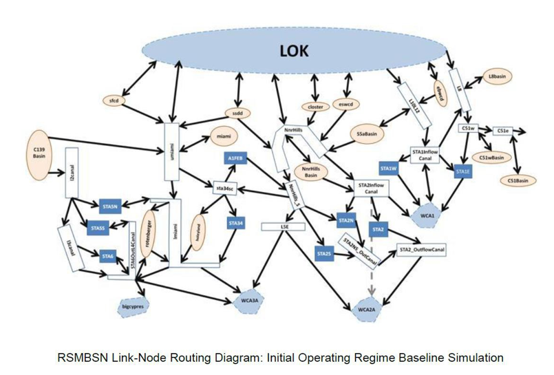
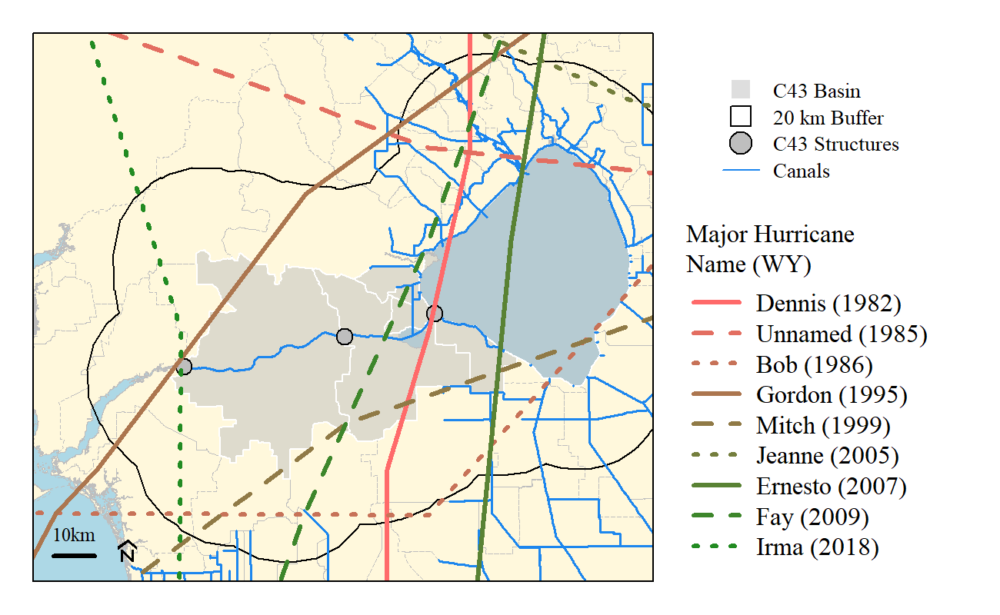
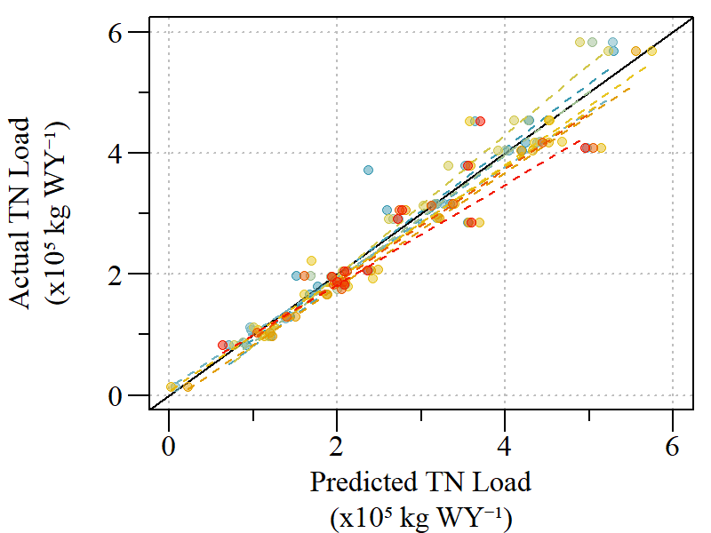
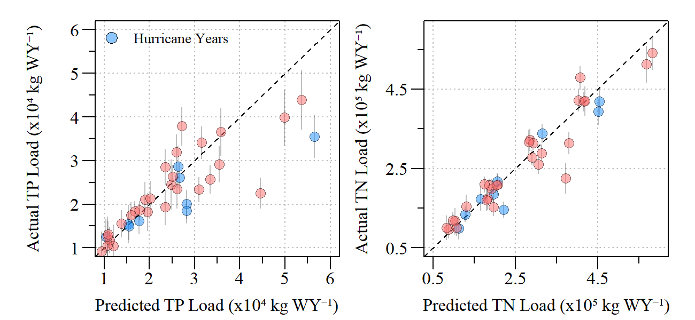
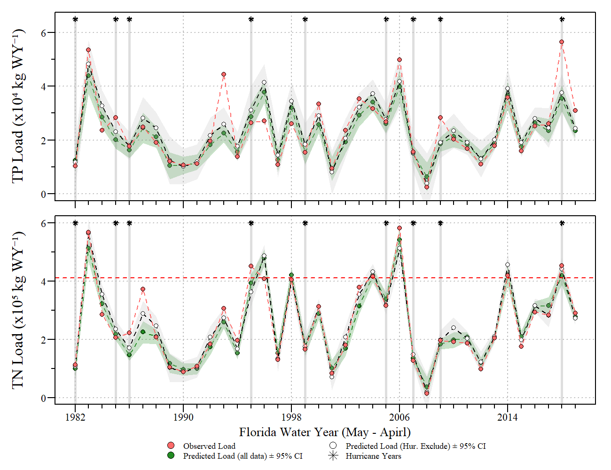
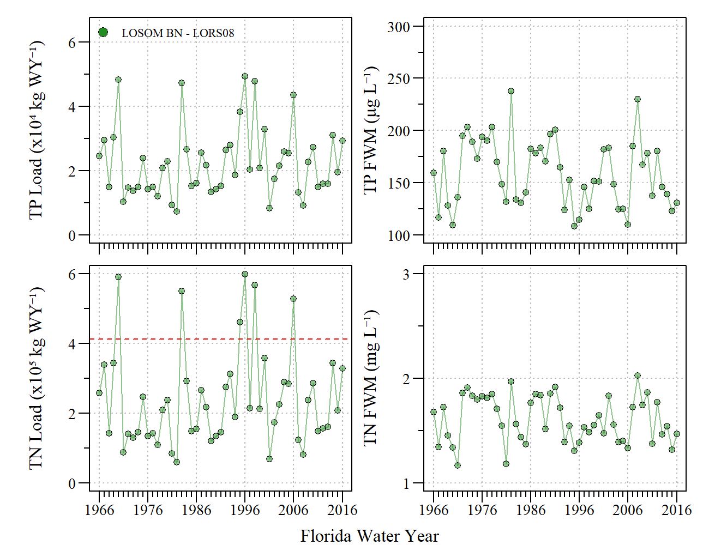

```{r setup, include=FALSE}
library(knitr)
library(fontawesome)

options(htmltools.dir.version = FALSE)
knitr::opts_chunk$set(warning = FALSE, message = FALSE, echo=FALSE)

```


layout: true

<div class="my-footer"><span>DRAFT</span></div>

<!-- this adds the link footer to all slides, depends on my-footer class in css-->
<!-- used https://arm.rbind.io/slides/xaringan.html to help build this presentation --->
<!--
```{r xaringan-logo, echo=FALSE}
#xaringanExtra::use_logo(
#  image_url = "D:/__logo/SWE_logo.png"
#)
```
--->

---
name: xaringan-title
class: left, middle

### Lake Okeechobee System Operating Manual<br>(WQ Subteam)

#### .fancy[DRAFT - Estuary Nutrient Loading Model]

<!--.large[<font color="white">Paul Julian, PhD | `r format(Sys.Date(),"%B %d,%Y")`</font>]-->

FDEP - Office of Water Policy and Ecosystem Restoration

`r format(as.Date("2020-09-14"),"%B %d, %Y")`

<!-- this ends up being the title slide since seal = FALSE-->

---
name: intro_goal
class: left

#### S-79 Water Quality Model

- __Goal:__ Develop a series of water quality models based on hydrodynamic indicators to be used in planning model scenario evaluation for LOSOM using RSMBN.

- __Period of Record:__ May 1980 – April 2019 (WY1981 – 2019)
  - Based on available data.
  - Years with major hurricanes were excluded. 

- __Parameters of Interest:__ Total Phosphorus and Total Nitrogen.

- __Predictor Variables:__ Discharge (S77, S78, S79, C43 Basin) converted from ft<sup>3</sup> s<sup>-1</sup> to Acre-Ft d<sup>-1</sup> and Lake Okeechobee stage elevation were considered.

- __Statistical Modeling:__
  - Multiple regression models using training and testing datasets (70:30). 
     - Training dataset: randomly sampled 70% of monthly data 
     - Testing dataset: remaining 30% was used for model testing
  - Verified with k-fold cross-validation linear modeling. 

---
name: RSM101 p1
class: left

#### Regional Simulation Model - Basins (RSMBN)

- A link-node application of the Regional Simulation Model (RSM) specific to Lake Okeechobee and Basins.

  - \>100 basins/lakes/canals represented
  
  - \>150 connections represented
  
- Used in prior planning efforts.

```{r RSM link,out.width="60%",fig.align="center"}

```


---
name: RSM101 p2
class: center

```{r RSM map,out.width="50%",fig.align="center"}
knitr::include_graphics('./resources/RSMBN_map.png')
```

Geographical representation of RSM-BN

---
name: hurricanes
class: left

- Annual TP and TN loads were estimated by interpolating water quality concentration daily from grab samples collected at each respective structure during days of observed flow (consistent with SFWMD Nutrient Load Program). 
  - Period of Record was restricted to WY 1982 – 2019.

- Major hurricane years were excluded from the dataset.
  - Major hurricane years were identified by major storms centerline that passed within 20 km of the C43 Basins and Lake Okeechobee.

```{r hurricane map,out.width="80%",fig.align="center"}

```

---
name: S79TP
class: left

#### S-79 Water Quality Model (Total Phosphorus)

```{r S79TP,fig.align="center"}

```

---
name: S79TP 2
class: left

#### S-79 Water Quality Model (Total Phosphorus)
- TP load was square-root transformed to fit the assumptions of linear modeling

- Model assumptions and verified
  - GVLMA (Global Stats = 4.37, $\rho$=0.36)

- Variance inflation factors (VIF) evaluated for model

- Residuals check for autocorrelation (Breusch-Godfrey test)
  - Breusch-Godfrey (LM test = 0.27, df = 1, $\rho$=0.60)

- Final Model:
\begin{align*}
\sqrt{TP Load_{S79}} = Q_{C43 Basin} +  Q_{S77} + Mean  Lake  Stage
\end{align*}


---
name: S79TP 3
class: left

#### S-79 Water Quality Model (Total Phosphorus)

\begin{align*}
\sqrt{TP Load_{S79}} = Q_{C43 Basin} +  Q_{S77} + Mean  Lake  Stage
\end{align*}


- Model Output:

```{r}
library(flextable)
library(magrittr)

rslt=data.frame(Parameter=c("(Intercept)","QC43Basin","QS77","Mean Lake Stage"),Estimate=c(30.68,2.166e-04,4.161e-05,17.07), stderror=c(181.8,7.334e-05,3.066e-05,15.70),tval=c(0.169,2.953,1.357,1.09),pvalue=c(0.86814,0.00935,0.19,2.89),VIF=c(NA,2.96,1.59,2.89))

flextable(rslt)%>%
  fontsize(size=12,part="header")%>%
  fontsize(size=10,part="body")%>%
  font(fontname="Arial",part="all")%>%
  align(j=2:ncol(rslt),align="center",part="all")%>%
  hline_top(border = officer::fp_border(width = 1.25))%>%
  hline_bottom(border = officer::fp_border(width = 1.25))%>%
  colformat_num(j=2:ncol(rslt),na_str="---",digits=2)%>%
  compose(i=2,j=1,as_paragraph("Q",as_sub("C43")))%>%
  compose(i=3,j=1,as_paragraph("Q",as_sub("S77")))%>%
  compose(i=4,j=1,as_paragraph("Mean Lake Stage"))%>%
  colformat_num(j=c(2,3,4,5),digits=2)%>%
  compose(i=2,j=2,as_paragraph("2.17x10",as_sup("-4")))%>%
  compose(i=2,j=3,as_paragraph("7.33x10",as_sup("-5")))%>%
  compose(i=2,j=5,as_paragraph("<0.01"))%>%
  compose(i=3,j=2,as_paragraph("4.16x10",as_sup("-5")))%>%
  compose(i=3,j=3,as_paragraph("3.07x10",as_sup("-5")))%>%
  set_header_labels("stderror"="Standard\nError","tval"="t-value","pvalue"="\u03C1-value")%>%
  width(width=c(1.5,1,1,1,1,1))%>%
  height(height=0.5)%>%
  footnote(i=1,j=1,part="header",
           value=as_paragraph("Residual standard error (\u03C3): 65.71 on 16 degrees of freedom"),
           ref_symbols = c(" "))%>%
  footnote(i=1,j=1,part="header",
           value=as_paragraph("Multiple R\u00B2: 0.79; Adj R\u00B2: 0.75"),
           ref_symbols = c(" "))%>%
  footnote(i=1,j=1,part="header",
           value=as_paragraph("F-statistic: 20.33 on 3 and 16 DF; \u03C1-value<0.01"),
           ref_symbols = c(" "))
```

---
name: S79TP 4
class: left

#### S-79 Water Quality Model (Total Phosphorus)

\begin{align*}
\sqrt{TP Load_{S79}} = Q_{C43 Basin} +  Q_{S77} + Mean  Lake  Stage
\end{align*}

.pull-left[
```{r S79TPrelimp,out.width="70%",fig.align="center"}
knitr::include_graphics('./resources/CRE_WY_TPMod_relaimpo.png')
```
Relative importance of each predictor calculated by partitioning R<sup>2</sup> by averaging sequential sums of squares over all orders of regressors (Lindeman et al 1979). All metrics are normalized to a sum of 100%.

]

.pull-right[

Relative Importance Metrics for the S79 TP Load annual model. 

```{r}
data.frame(pred=c("QC43","QS77","Stage"),Per.R2=c(46.5,21.0,32.3))%>%
  flextable()%>%
  fontsize(size=12,part="all")%>%
  font(fontname="Arial",part="all")%>%
  hline_top(border = officer::fp_border(width = 1.25))%>%
  hline_bottom(border = officer::fp_border(width = 1.25))%>%
  #hline(border = officer::fp_border(width = 1.25), part = "all")%>%
  align(j=1,align="left",part="all")%>%
  align(j=2,align="center",part="all")%>%
  compose(i=1,j=1,as_paragraph("Q",as_sub("C43")))%>%
  compose(i=2,j=1,as_paragraph("Q",as_sub("S77")))%>%
  compose(i=3,j=1,as_paragraph("Mean Lake Stage"))%>%
  width(width=c(1.5,1))%>%
  set_header_labels("pred"="Predictor","Per.R2"="Percent of R\u00B2")


```
]

---
name: S79TP 5
class: left

#### S-79 Water Quality Model (Total Phosphorus)

\begin{align*}
\sqrt{TP Load_{S79}} = Q_{C43 Basin} +  Q_{S77} + Mean  Lake  Stage
\end{align*}

.pull-left[
```{r S79TPPred.width="70%",fig.align="center"}
knitr::include_graphics('./resources/C43TPLoad_WY_ActualPred.png')
```
Actual versus predicted TP loads at S-79 based on predictive model. Actual and predicted concentration were highly correlated (Spearman’s correlation: r=0.83, $\rho$<0.01).
]

.pull-right[
Train:Test
  - R<sup>2</sup>: 0.79
  - RMSE: 65.71
  - Mean Absolute Present Error: 21 %
  - Min-Max Accuracy: 82 %

]

---
name: S79TP 6
class: left

#### S-79 Water Quality Model (Total Phosphorus)

\begin{align*}
\sqrt{TP Load_{S79}} = Q_{C43 Basin} +  Q_{S77} + Mean  Lake  Stage
\end{align*}

.pull-left[
```{r S79TPPredk.width="70%",fig.align="center"}
knitr::include_graphics('./resources/C43TPLoad_WY_kmodel.png')
```
Actual versus predicted TP loads at S-79 with each k-model presented. 
]

.pull-right[
k-fold (k=10)

_Cross-validation error (average k errors)_
  - R<sup>2</sup>: 0.79
  - RMSE: 61.0
  - Mean Absolute Present Error: 24 %
  - Min-Max Accuracy: 82 %
]

---
name: S79TN
class: left

#### S-79 Water Quality Model (Total Nitrogen)

```{r S79TN,fig.align="center"}
knitr::include_graphics('./resources/S79_TN.png')
```

---
name: S79TN 2
class: left

#### S-79 Water Quality Model (Total Nitrogen)
- No response variable transformation performed

- Model assumptions and verified
  - GVLMA (Global Stats = 4.77, $\rho$=0.31)

- Variance inflation factors (VIF) evaluated for model

- Residuals check for autocorrelation (Breusch-Godfrey test)
  - Breusch-Godfrey (LM test = 0.73, df = 1, $\rho$=0.39)

- Final Model:
\begin{align*}
TN Load_{S79} = Q_{C43 Basin} +  Q_{S77} + Mean  Lake  Stage
\end{align*}

---
name: S79TN 3
class: left

#### S-79 Water Quality Model (Total Nitrogen)

\begin{align*}
TN Load_{S79} = Q_{C43 Basin} +  Q_{S77} + Mean  Lake  Stage
\end{align*}

- Model Output:

```{r}
rslt=data.frame(Parameter=c("(Intercept)","QC43Basin","QS77","Mean Lake Stage"),Estimate=c(-5.195e4,2.42,1.16,2.346e3), stderror=c(1.139e6,4.595e-1,1.921e-1,9.834e4),tval=c(-0.046,5.270,6.021,0.024),pvalue=c(0.964,7.62e-5,1.78e-5,0.981),VIF=c(NA,2.96,1.59,2.89))

flextable(rslt)%>%
  fontsize(size=12,part="header")%>%
  fontsize(size=10,part="body")%>%
  font(fontname="Arial",part="all")%>%
  align(j=2:ncol(rslt),align="center",part="all")%>%
  hline_top(border = officer::fp_border(width = 1.25))%>%
  hline_bottom(border = officer::fp_border(width = 1.25))%>%
  colformat_num(j=2:ncol(rslt),na_str="---",digits=2)%>%
  compose(i=2,j=1,as_paragraph("Q",as_sub("C43")))%>%
  compose(i=3,j=1,as_paragraph("Q",as_sub("S77")))%>%
  compose(i=4,j=1,as_paragraph("Mean Lake Stage"))%>%
  colformat_num(j=c(2,3,4,5),digits=2)%>%
  compose(i=1,j=2,as_paragraph("5.20x10",as_sup("4")))%>%
  compose(i=4,j=2,as_paragraph("2.35x10",as_sup("3")))%>%
  compose(i=2,j=5,as_paragraph("<0.01"))%>%
  compose(i=3,j=5,as_paragraph("<0.01"))%>%
  compose(i=1,j=3,as_paragraph("1.14x10",as_sup("6")))%>%
  compose(i=4,j=3,as_paragraph("9.83x10",as_sup("4")))%>%
  set_header_labels("stderror"="Standard\nError","tval"="t-value","pvalue"="\u03C1-value")%>%
  width(width=c(1.5,1,1,1,1,1))%>%
  height(height=0.5)%>%
  footnote(i=1,j=1,part="header",
           value=as_paragraph("Residual standard error (\u03C3): 4.11x10",as_sup("5")," on 16 degrees of freedom"),
           ref_symbols = c(" "))%>%
  footnote(i=1,j=1,part="header",
           value=as_paragraph("Multiple R\u00B2: 0.93; Adj R\u00B2: 0.92"),
           ref_symbols = c(" "))%>%
  footnote(i=1,j=1,part="header",
           value=as_paragraph("F-statistic: 73.87 on 3 and 16 DF; \u03C1-value<0.01"),
           ref_symbols = c(" "))
```

---
name: S79TN 4
class: left

#### S-79 Water Quality Model (Total Nitrogen)

\begin{align*}
TP Load_{S79} = Q_{C43 Basin} +  Q_{S77} + Mean  Lake  Stage
\end{align*}

.pull-left[
```{r S79TNrelimp,out.width="70%",fig.align="center"}
knitr::include_graphics('./resources/CRE_WY_TNMod_relaimpo.png')
```
Relative importance of each predictor calculated by partitioning R<sup>2</sup> by averaging sequential sums of squares over all orders of regressors (Lindeman et al 1979). All metrics are normalized to a sum of 100%.

]

.pull-right[

Relative Importance Metrics for the S79 TN Load annual model. 

```{r}
data.frame(pred=c("QC43","QS77","Stage"),Per.R2=c(39.6,37.9,22.5))%>%
  flextable()%>%
  fontsize(size=12,part="all")%>%
  font(fontname="Arial",part="all")%>%
  hline_top(border = officer::fp_border(width = 1.25))%>%
  hline_bottom(border = officer::fp_border(width = 1.25))%>%
  #hline(border = officer::fp_border(width = 1.25), part = "all")%>%
  align(j=1,align="left",part="all")%>%
  align(j=2,align="center",part="all")%>%
  compose(i=1,j=1,as_paragraph("Q",as_sub("C43")))%>%
  compose(i=2,j=1,as_paragraph("Q",as_sub("S77")))%>%
  compose(i=3,j=1,as_paragraph("Mean Lake Stage"))%>%
  width(width=c(1.5,1))%>%
  set_header_labels("pred"="Predictor","Per.R2"="Percent of R\u00B2")


```
]

---
name: S79TN 5
class: left

#### S-79 Water Quality Model (Total Nitrogen)

\begin{align*}
TP Load_{S79} = Q_{C43 Basin} +  Q_{S77} + Mean  Lake  Stage
\end{align*}

.pull-left[
```{r S79TNPred,out.width="70%",fig.align="center"}
knitr::include_graphics('./resources/C43TNLoad_WY_ActualPred.png')
```
Actual versus predicted TP loads at S-79 based on predictive model. Actual and predicted concentration were highly correlated (Spearman’s correlation: r=0.95, $\rho$<0.01).
]

.pull-right[
Train:Test
  - R<sup>2</sup>: 0.93
  - RMSE: 4.11x10<sup>5</sup>
  - Mean Absolute Present Error: 10 %
  - Min-Max Accuracy: 92 %

]

---
name: S79TN 6
class: left

#### S-79 Water Quality Model (Total Nitrogen)

\begin{align*}
TP Load_{S79} = Q_{C43 Basin} +  Q_{S77} + Mean  Lake  Stage
\end{align*}

.pull-left[
```{r S79TNPredk,out.width="70%",fig.align="center"}

```
Actual versus predicted TP loads at S-79 with each k-model presented. 
]

.pull-right[
k-fold (k=10)

_Cross-validation error (average k errors)_
  - R<sup>2</sup>: 0.94
  - RMSE: 3.57x10<sup>5</sup>
  - Mean Absolute Present Error: 11 %
  - Min-Max Accuracy: 90 %
]


---
name: WQMods
class: left

#### S-79 Water Quality Models

```{r S79WQmods,fig.align="center"}

```

Annual observed versus predicted ( $\pm$ 95% CI) S-79 load during the period of record (WY1982 – WY 2019) with hurricane years identified. 

---
name: WQMods2
class: left

#### S-79 Water Quality Models

```{r S79WQmods2,out.width="45%",fig.align="center"}

```

Annual observed versus predicted ( $\pm$ 95% CI) S-79 load during the period of record (WY1982 – WY 2019) with hurricane years identified. 

---
name: RSM
class: left

#### S-79 Water Quality Models

### Application of model with RSM-BN outputs<sup>1</sup>

```{r RSM,out.width="80%",fig.align="center"}

```

__Provisional RSM BN outputs with POR extension. For demonstration/testing purposes only.__

---
name: RSM2
class: left

#### S-79 Water Quality Models

### Application of model with RSM-BN outputs<sup>1</sup>

```{r RSM Nutrient,out.width="70%",fig.align="center"}

```

__Provisional RSM BN outputs with POR extension. For demonstration/testing purposes only.__

---
name: last slide
class: left

### Acknowledgements

#### Data

```{r ,out.width="10%"}
knitr::include_graphics("https://www.sfwmd.gov/sites/default/files/documents/sfwmd-seal-hq.png")
```
South Florida Water Management District ([DBHYDRO](https://www.sfwmd.gov/science-data/dbhydro))


#### Slides

* HTML [Slide deck](http://swampthingecology.org/LOSOM_ENLM/Julian_LOSOM_ENLM) &copy; Julian (2020) [](http://creativecommons.org/licenses/by/4.0/)

* RMarkdown [Source](https://github.com/SwampThingPaul/LOSOM_ENLM)

<br>

```{r ,out.width="15%",fig.align="center"}
knitr::include_graphics("https://floridadep.gov/system/files/styles/general_page_images__scaled_to_900_pixels_/private/media-folders/media-root/in-house-graphic-DEP%20Logo%20color%20Large.png?itok=wm1GoIhx")
```
<center><font color="red">Draft FDEP Workproduct</font></center>

