```{r setup, include=FALSE}
# libraries
library(knitr)
library(fontawesome)

library(flextable)
library(magrittr)

options(htmltools.dir.version = FALSE)
knitr::opts_chunk$set(warning = FALSE, message = FALSE, echo=FALSE)
## Paths
wd="C:/Julian_LaCie/_Github/LOSOM_ENLM"

paths=paste0(wd,c("/resources/","/Export/","/Data/"))
# Folder.Maker(paths);#One and done. Creates folders in working directory.
plot.path=paths[1]
export.path=paths[2]
data.path=paths[3]

## Functions
notidy_glance_lm=function(model,...){
  # check whether the model was fitted with only an intercept, in which
  # case drop the fstatistic related columns
  int_only <- nrow(summary(model)$coefficients) == 1
  
  with(
    summary(model),
    data.frame(
      r.squared = r.squared,
      adj.r.squared = adj.r.squared,
      sigma = sigma,
      statistic = if (!int_only) {fstatistic["value"]} else {NA},
      p.value = if (!int_only) {
        pf(
          fstatistic["value"],
          fstatistic["numdf"],
          fstatistic["dendf"],
          lower.tail = FALSE
        )
      } else {NA},
      df = if (!int_only) {fstatistic["numdf"]} else {NA},
      logLik = as.numeric(stats::logLik(model)),
      AIC = stats::AIC(model),
      BIC = stats::BIC(model),
      deviance = stats::deviance(model),
      df.residual = df.residual(model),
      nobs = stats::nobs(model)
    )
  )
}

notidy_tidy_lm <- function(model, conf.int = FALSE, conf.level = 0.95, ...) {
  
  ret <- data.frame(summary(model)$coefficients)
  ret$term<-rownames(ret)
  rownames(ret)=NULL
  ret<-ret[,c(5,1:4)]
  colnames(ret) <- c("term", "estimate", "std.error", "statistic", "p.value")
  
  if(conf.int){
    ci <- confint(model,level=conf.level)
    ci <- data.frame(ci)
    ci$term<-rownames(ci)
    rownames(ci)=NULL
    ci<-ci[,c(3,1,2)]
    names(ci)<- c("term","conf.low","conf.high")
    
    ret<-merge(ret,ci,"term")
  }
  ret
}

# data_t=notidy_tidy_lm(mod.TN)
# data_g=notidy_glance_lm(mod.TN)

notidy_as_flextable<-function(x,data_t=NULL,data_g=NULL,dig.num=2,r2dig=2,alpha.val=0.01,sig.code=FALSE,...){
 # needs flextable

    pvalue_format <- function(x){
    z <- cut(x, breaks = c(-Inf, 0.001, 0.01, 0.05, 0.1, Inf), labels = c("***", "**", "*", ".", ""))
    as.character(z)
    }
  
  if(class(x)=="lm"&is.null(data_t)&is.null(data_g)){
  data_t <- notidy_tidy_lm(x)
  data_g <- notidy_glance_lm(x)
  }
  
  if(sig.code==TRUE){
    ft <- flextable(data_t, col_keys = c("term", "estimate", "std.error", "statistic", "p.value", "signif"))
    ft <- colformat_num(ft, j = c("estimate", "std.error", "statistic"), digits = dig.num)
    ft <- colformat_num(ft, j = c("p.value"), digits = dig.num)
    ft <- compose(ft, j = "signif", value = as_paragraph(pvalue_format(p.value)) )
    ft <- set_header_labels(ft, term = "", estimate = "Estimate",
                          std.error = "Standard Error", statistic = "t-value",
                          p.value = "\u03C1-value", signif = "" )
    dimpretty <- dim_pretty(ft, part = "all")
  
  ft <- add_footer_lines(ft, values = c(
    "Signif. codes: 0 \u2264 '***' < 0.001 < '**' < 0.01 < '*' < 0.05 < '.' < 0.1 < ' ' < 1",
    "",
    sprintf("Residual standard error: %s on %.0f degrees of freedom", formatC(data_g$sigma,format=sigma.form), data_g$df.residual),
    sprintf("Multiple R-squared: %s, Adjusted R-squared: %s", formatC(data_g$r.squared,digits = r2dig,format="f"), formatC(data_g$adj.r.squared,digits = r2dig,format="f")),
     paste0("F-statistic: ",formatC(data_g$statistic)," on ",data_g$df.residual, " and ",data_g$df, ", \u03C1-value:",ifelse(data_g$p.value<alpha.val,paste("\u2264",alpha.val),format(round(p.value,2),nsmall=2)))
  ))
  }else{
    data_t$p.value<-with(data_t,ifelse(p.value<=alpha.val,paste0("\u2264 ",alpha.val),format(round(p.value,2),nsmall=2))) 
    data_g$p.value<-with(data_g,ifelse(p.value<=alpha.val,paste0("\u2264 ",alpha.val),format(round(p.value,2),nsmall=2)))
    
    ft <- flextable(data_t, col_keys = c("term", "estimate", "std.error", "statistic", "p.value", "signif"))
    ft <- colformat_num(ft, j = c("estimate", "std.error", "statistic"), digits = dig.num)
    # ft <- colformat_num(ft, j = c("p.value"), digits = dig.num)
    ft <- set_header_labels(ft, term = "", estimate = "Estimate",
                          std.error = "Standard Error", statistic = "t-value",
                          p.value = "\u03C1-value", signif = "" )
    dimpretty <- dim_pretty(ft, part = "all")
  
  ft <- add_footer_lines(ft, values = c(
    "",
    sprintf("Residual standard error: %s on %.0f degrees of freedom", formatC(data_g$sigma,digits = dig.num), data_g$df.residual),
    sprintf("Multiple R-squared: %s, Adjusted R-squared: %s", formatC(data_g$r.squared,digits = r2dig,format="f"), formatC(data_g$adj.r.squared,digits = r2dig,format="f")),
    paste0("F-statistic: ",formatC(data_g$statistic)," on ",data_g$df.residual, " and ",data_g$df, ", \u03C1-value: ",data_g$p.value)
    ))
  }
  ft <- align(ft,j=5,align="right")
  ft <- align(ft,j=5,align="right",part="all")
  ft <- align(ft, i = 1, align = "right", part = "footer")
  ft <- italic(ft, i = 1, italic = TRUE, part = "footer")
  ft <- hrule(ft, rule = "auto")
  ft <- autofit(ft, part = c("header", "body"))
  ft
}


```


layout: true

<div class="my-footer">
<span>DRAFT</span>
</div>

<!-- this adds the link footer to all slides, depends on my-footer class in css-->
<!-- used https://arm.rbind.io/slides/xaringan.html to help build this presentation --->
<!--
```{r xaringan-logo, echo=FALSE}
#xaringanExtra::use_logo(
#  image_url = "D:/__logo/SWE_logo.png"
#)
```
--->

---
name: xaringan-title
class: left, middle

### Lake Okeechobee System Operating Manual<br>(WQ Subteam)

#### .fancy[DRAFT - St Lucie Estuary Nutrient Loading Model]

<!--.large[<font color="white">Paul Julian, PhD | `r format(Sys.Date(),"%B %d,%Y")`</font>]-->

FDEP - Office of Water Policy and Ecosystem Restoration

`r format(as.Date(Sys.Date()),"%B %d, %Y")`

<!-- this ends up being the title slide since seal = FALSE-->

???
- Similar to CRE models
- Top down statistical modeling, where we used observed water quality and discharge data to fit a model. 
- Does not 100% account for C-44 reservior and STA. Could assume a metric ton reduction based on assumed treatment.
- Does not account for *potential* nutrient reductions assoicated with the current Basin Action Management Plan(s). 
- WQ could extend model period of record to WY2020 (currently CRE and SLE models are set to 2019)

---
name: map
class: middle

```{r overall map link,out.width="100%",fig.align="center"}
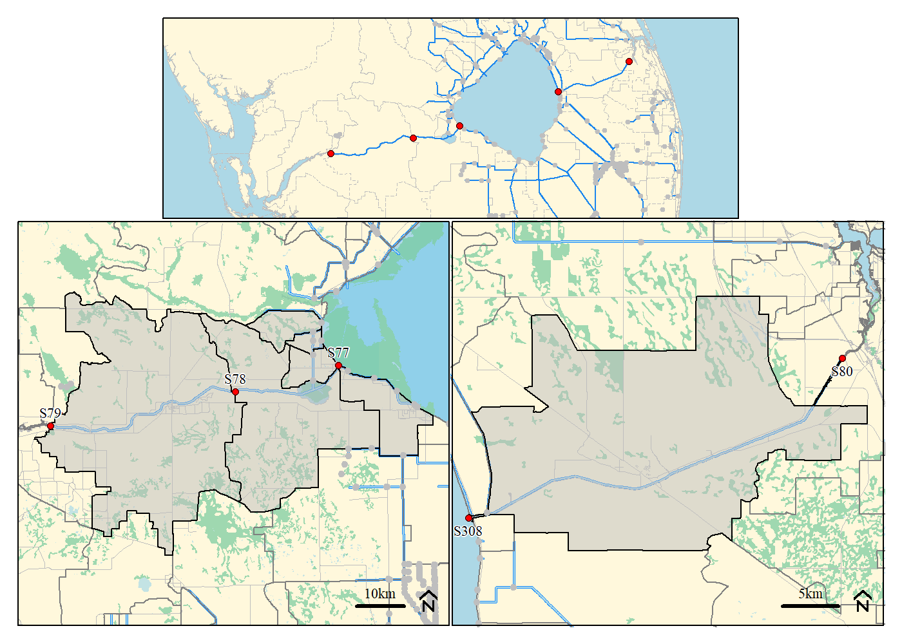
```


---
name: intro_goal
class: left

#### S-80 Water Quality Models

- __Goal:__ Develop a series of water quality models based on hydrodynamic indicators to be used in planning model scenario evaluation for LOSOM using RSMBN.

--

- __Period of Record:__ May 1981 – April 2019 (WY1982 – 2019)

--

- __Parameters of Interest:__ Total Phosphorus and Total Nitrogen.

--

- __Predictor Variables:__ Discharge (S80, S308 and C44 Basin) converted from ft<sup>3</sup> s<sup>-1</sup> to Acre-Ft d<sup>-1</sup> and Lake Okeechobee stage elevation were considered.

--

- __Statistical Modeling:__
  - Multiple regression models using training and testing datasets (70:30). 
     - Training dataset: randomly sampled 70% of monthly data 
     - Testing dataset: remaining 30% was used for model testing
  - Verified with k-fold cross-validation linear modeling. 

--

- Consistent with Caloosahatchee River Estuary Nutrient Loading Model.

???
- Set period of record similar to CRE model


---
name: hydro
class: left

#### C-44 Hydrology
.pull-left[
```{r,out.width="100%",fig.align="center"}
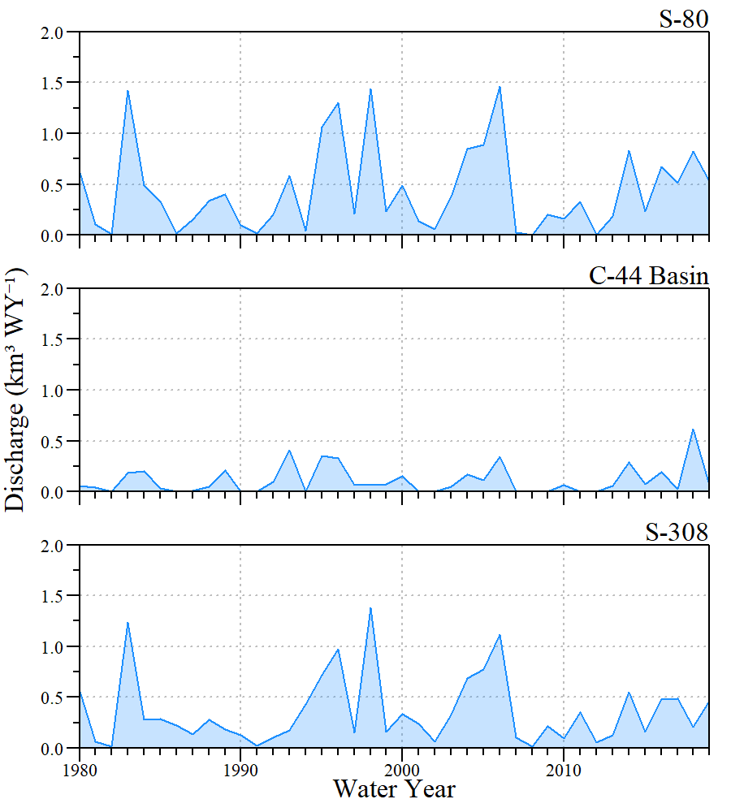
```

- Percent of Basin Discharge
  - $Q_{C44}/Q_{S80}$ 
  - Range from 0 to 74.8 %

]
--
.pull-right[

<br>
<br>

```{r,out.width="100%",fig.align="center"}
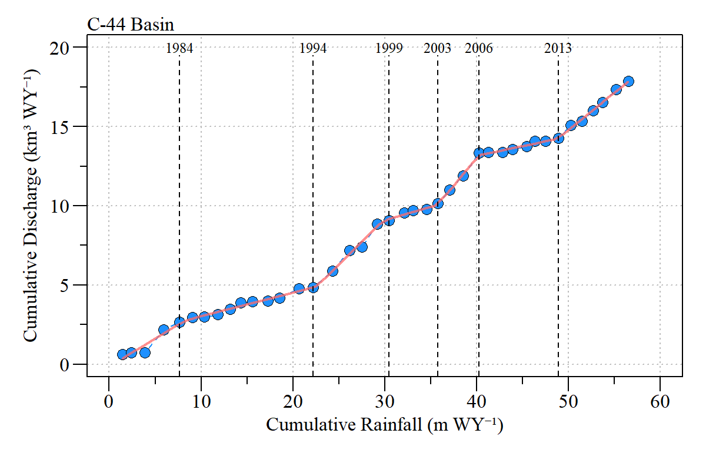
```

Cumulative discharge (S80) and rainfall (across C44 basin) for the period of May 1979 - Apirl 2019 (WY1980 - 2019) with breakpoints identified using segmented regression. 

.small[ 
  - Rainfall monitoring sites used include *S308R, S135R, S80R, PRATT and ACRA2*
]


]
---
name: S80TP
class: left

#### S-80 Water Quality Model (Total Phosphorus)

```{r,fig.align="center"}
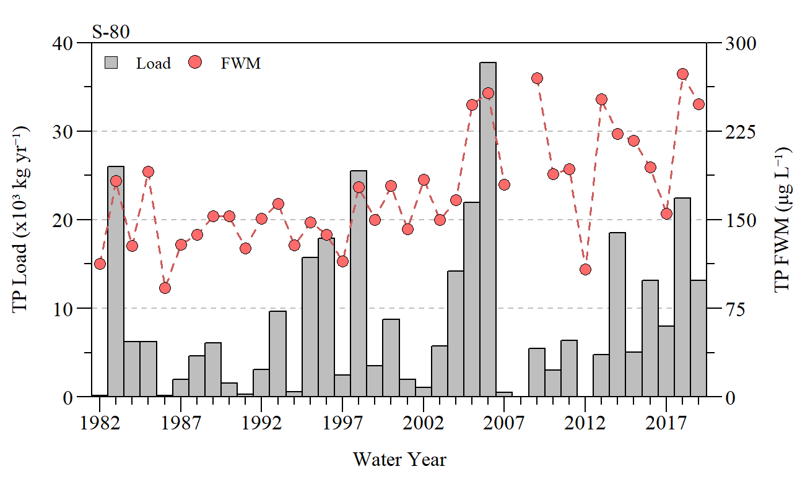
```

---
name: S80TP_2
class: left

#### S-80 Water Quality Model (Total Phosphorus)

\begin{align*}
ln(TP Load_{S80}) = Q_{C44 Basin} +  Q_{S308} + ln(Q.S80)+ Mean  Lake  Stage
\end{align*}

<br>


- TP load was log-transformed to fit the assumptions of linear modeling.
  - Excluded WY2008 and WY2012 from analysis (No/low flow conditions)

--

- Model assumptions tested and verified (see [Model Diagnostics](#TP_diag))
  - GVLMA (Global Stats = 1.75, $\rho$=0.78)

- Variance inflation factors (VIF) evaluated for model

```{r,echo=F}
S80.TP.vif=data.frame(Variable=c("Q.C44", "Q.S308", "log(Q.S80)", "mean.stg"),VIF=c(2.35399137980296, 2.14966811692914, 3.53078128274024, 2.88407807125901
))

S80.TP.vif%>%
  flextable()%>%
  font(fontname="Arial",part="all")%>%
  bold(part="header")%>%
  compose(i=1,j=1,as_paragraph("Q",as_sub("C44")))%>%
  compose(i=2,j=1,as_paragraph("Q",as_sub("S308")))%>%
  compose(i=3,j=1,as_paragraph("ln(Q",as_sub("S80"),")"))%>%
  compose(i=4,j=1,as_paragraph("Mean Lake Stage"))%>%
  colformat_num(j=2,digits=2)%>%
  fontsize(size=12,part="header")%>%
  fontsize(size=10,part="body")%>%
  align(j=2,align="center",part="all")%>%
  width(width=c(1.25,0.5))

```

- Residuals check for residual autocorrelation (Breusch-Godfrey test)
  - Breusch-Godfrey (LM test = 3.51, df = 1, $\rho$=0.48)

--

---
name: S80TP_3
class: left

#### S-80 Water Quality Model (Total Phosphorus)

\begin{align*}
ln(TP Load_{S80}) = Q_{C44 Basin} +  Q_{S308} + ln(Q_{S80})+ Mean  Lake  Stage
\end{align*}

```{r}
mod.est=read.csv(paste0(export.path,"S80_TP_mod_est.csv"))
mod.sum=read.csv(paste0(export.path,"S80_TP_mod_sum.csv"))
mod.sum$DF.f=with(mod.sum,paste(df,df.residual,sep=", "))

cap.val="S-80 total phosphorus model results and estimates using available data during the water year 1982 - 2019 period. Data were split into training and testing datasets (70:30)."
notidy_as_flextable(x=NULL,data_g=subset(mod.sum,response=="TPLoad"&note=="all-data"),
                    data_t=subset(mod.est,response=="TPLoad"&note=="all-data"),dig.num = 2)%>%
  compose(i=2,j=1,as_paragraph("Q",as_sub("C44")))%>%
  compose(i=3,j=1,as_paragraph("Q",as_sub("S308")))%>%
  compose(i=4,j=1,as_paragraph("ln(Q",as_sub("S80"),")"))%>%
  compose(i=5,j=1,as_paragraph("Mean Lake Stage"))%>%
  compose(i=2,j=2,as_paragraph("-2.85x10",as_sup("-7")))%>%
  compose(i=3,j=2,as_paragraph("-5.29x10",as_sup("-8")))%>%
  
  compose(i=2,j=3,as_paragraph("7.07x10",as_sup("-7")))%>%
  compose(i=3,j=3,as_paragraph("2.35x10",as_sup("-7")))%>%
  width(width=c(1.5,1.2,1.2,1.2,1.2,0.1))%>%
  fontsize(size=13,part="header")%>%
  fontsize(size=11,part="body")%>%
  align(j=2:5,align="center",part="all")%>%
  add_header_lines(values=cap.val)%>%fontsize(size=13,part="header")%>%
  bold(part="header")


```

.small[.small[
* ln(Q<sub>S80</sub>) was included in the model to account for extreme variability in annual discharge and load. Exclusion of this parameter results in significant autocorrelation of the model residuals and loss of residual heteroscedasticity.
]
]
--
.center[
.small[
\begin{align*}
ln(TP Load_{S80}) = -2.49 - (2.85x10^{-7}\times Q_{C44 Basin}) - (5.29x10^{-8}\times Q_{S308}) + (1.22\times ln(Q_{S80}))\\- (0.13\times Mean Stage)
\end{align*}

]
]
<br>

.footnote[
.small[[Model Diagnostics](#TP_diag) plots]
]

---
name: S80TP_4
class: left

#### S-80 Water Quality Model (Total Phosphorus)

\begin{align*}
ln(TP Load_{S80}) = Q_{C44 Basin} +  Q_{S308} + ln(Q_{S80})+ Mean  Lake  Stage
\end{align*}

.pull-left[
```{r ,out.width="70%",fig.align="center"}
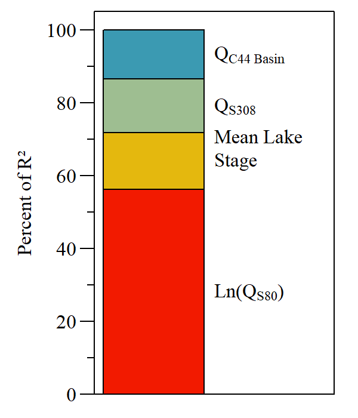
```
Relative importance of each predictor calculated by partitioning R<sup>2</sup> by averaging sequential sums of squares over all orders of regressors (Lindeman et al 1979). All metrics are normalized to a sum of 100%.

]
--
.pull-right[

Relative Importance Metrics for the S80 TP Load annual model. 

```{r}
data.frame(pred=c("QC44","QS308","log(Q.S80)","Stage"),Per.R2=c(13.5,14.8,56.2,15.6))%>%
  flextable()%>%
  fontsize(size=14,part="all")%>%
  font(fontname="Arial",part="all")%>%
  bold(part="header")%>%
  # hline_top(border = officer::fp_border(width = 1.25))%>%
  # hline_bottom(border = officer::fp_border(width = 1.25))%>%
  #hline(border = officer::fp_border(width = 1.25), part = "all")%>%
  align(j=1,align="left",part="all")%>%
  align(j=2,align="center",part="all")%>%
  compose(i=1,j=1,as_paragraph("Q",as_sub("C44")))%>%
  compose(i=2,j=1,as_paragraph("Q",as_sub("S308")))%>%
  compose(i=3,j=1,as_paragraph("ln(Q",as_sub("S80"),")"))%>%
  compose(i=4,j=1,as_paragraph("Mean Lake Stage"))%>%
  width(width=c(1.75,1.2))%>%
  set_header_labels("pred"="Predictor","Per.R2"="Percent of R\u00B2")
```

.footnote[
.small[
- Lindeman RH, Merenda PF, Gold RZ (1979) Introduction to bivariate and multivariate analysis. Scott Foresman & Co, Glenview, Illinois, USA
]]

]

---
name: S80TP_5
class: left

#### S-80 Water Quality Model (Total Phosphorus)

\begin{align*}
ln(TP Load_{S80}) = Q_{C44 Basin} +  Q_{S308} + ln(Q_{S80})+ Mean  Lake  Stage
\end{align*}


.pull-left[
```{r ,fig.align="center"}
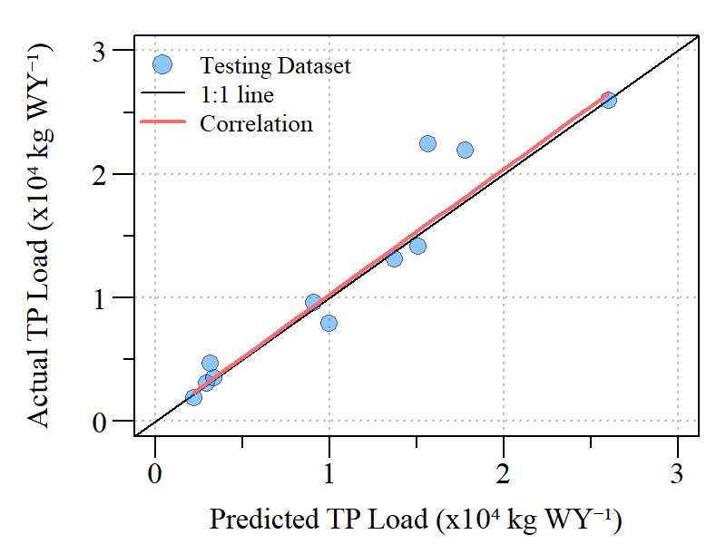
```
Actual versus predicted TP loads at S-80 based on predictive model. Actual and predicted concentration were highly correlated (Spearman’s correlation: r=0.97, $\rho$<0.01).
]

--
.pull-right[

<br>

Model Fit
  - $R^{2}_{adj}$ : 0.98
  - RSE : 0.22
  
Train:Test
  - Mean Absolute Percent Error: 13 %
  - Min-Max Accuracy: 87 %
  - Nash-Sutcliffe Coefficient: 0.90
  - Kling-Gupta Coefficient: 0.86

.footnote[
.small[[Nash-Sutcliffe/Kling-Gupta explainations](#EffCoef)]

]

]

???
Model RSE (backtransformed):  26739.11

Mean absolute percentage error - lower the better
Min_Max Accuracy - higher the better
Nash-Sutcliffe - 1 = perfect model (error variance divided by observed variance); https://en.wikipedia.org/wiki/Nash%E2%80%93Sutcliffe_model_efficiency_coefficient

Kling-Gupta - similar to NS range -1 to 1

---
name: S80TP_6
class: left

#### S-80 Water Quality Model (Total Phosphorus)

\begin{align*}
ln(TP Load_{S80}) = Q_{C44 Basin} +  Q_{S308} + ln(Q_{S80})+ Mean  Lake  Stage
\end{align*}

.pull-left[
```{r ,fig.align="center"}
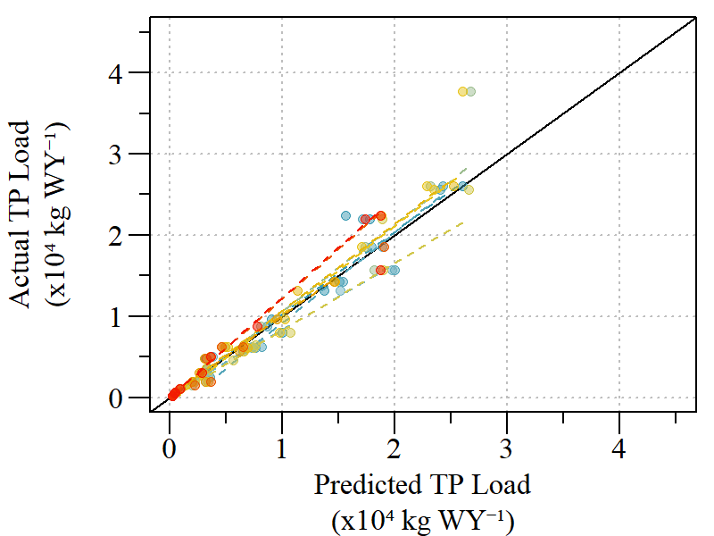
```
Actual versus predicted TP loads at S-80 with each k-model presented. 
]

--
.pull-right[
k-fold (k=10)

_Cross-validation error (average k errors)_

```{r}
data.frame(source=c(rep("Model",2),rep("Train:Test",4)),Parameter=c("R2adj","RMSE","MAPE","MMA","NS","KG"),
           Mean=c(0.97,0.20,19,84,0.93,0.86),
           Min=c(0.96,0.17,13,78,0.89,0.74),
           Max=c(0.98,0.23,28,88,0.97,0.98))%>%
  flextable()%>%
  font(fontname="Arial",part="all")%>%
  bold(part="header")%>%
  fontsize(size=13,part="header")%>%
  fontsize(size=11,part="body")%>%
  colformat_num(i=3:4,j=3:5,digits=0)%>%
  align(align="left",part="all")%>%
  align(j=3:5,align="center",part="all")%>%
  merge_v(j=1)%>%valign(j=1,valign="top")%>%
  compose(i=1,j=2,as_paragraph("R",as_sup("2"),as_sub("adj")))%>%
  width(width=c(1,1,1,1,1))%>%
  set_header_labels("source"=" ","Per.R2"="Percent of R\u00B2")%>%
  fix_border_issues()%>%
  footnote(i=3:4,j=2,part="body",
           value=as_paragraph(" Mean Absolute Percent Error (MAPE) and Min-Max Accuracy (MMA) expressed in percent"),
           ref_symbols = c(" 1"))%>%
    footnote(i=5,j=2,part="body",
           value=as_paragraph(" NS = Nash-Sutcliffe coefficient"),
           ref_symbols = c(" 2"))%>%
    footnote(i=6,j=2,part="body",
           value=as_paragraph(" KG = Kling-Gupta coefficient"),
           ref_symbols = c(" 2"))

```


]

---
name: S80TN
class: left

#### S-80 Water Quality Model (Total Nitrogen)

```{r,fig.align="center"}
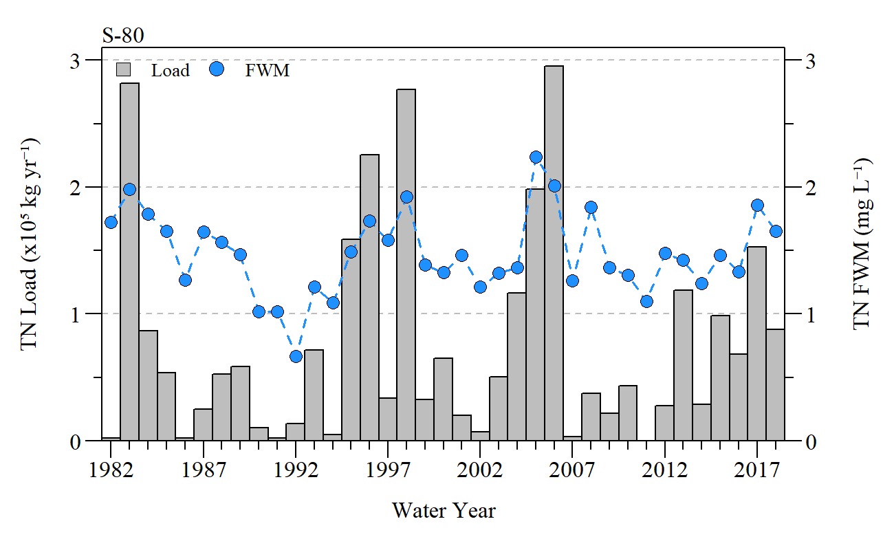
```

---
name: S80TN_2
class: left

#### S-80 Water Quality Model (Total Nitrogen)

\begin{align*}
ln(TN Load_{S80}) = Q_{C44 Basin} +  Q_{S308} + ln(Q_{S80})+ Mean  Lake  Stage
\end{align*}

<br>

- TP load was log-transformed to fit the assumptions of linear modeling.
  - Excluded WY2008 and WY2012 from analysis (No/low flow conditions)

--

- Model assumptions tested and verified (see [Model Diagnostics](#TN_diag))
  - GVLMA (Global Stats = 6.67, $\rho$=0.15)

- Variance inflation factors (VIF) evaluated for model

```{r,echo=F}
S80.TN.vif=data.frame(Variable=c("Q.C44", "Q.S308", "log(Q.S80)", "mean.stg"),VIF=c(2.35399137980296, 2.14966811692914, 3.53078128274024, 2.88407807125901
))

S80.TN.vif%>%
  flextable()%>%
  font(fontname="Arial",part="all")%>%
  bold(part="header")%>%
  compose(i=1,j=1,as_paragraph("Q",as_sub("C44")))%>%
  compose(i=2,j=1,as_paragraph("Q",as_sub("S308")))%>%
  compose(i=3,j=1,as_paragraph("ln(Q",as_sub("S80"),")"))%>%
  compose(i=4,j=1,as_paragraph("Mean Lake Stage"))%>%
  colformat_num(j=2,digits=2)%>%
  fontsize(size=12,part="header")%>%
  fontsize(size=10,part="body")%>%
  align(j=2,align="center",part="all")%>%
  width(width=c(1.25,0.5))

```

- Residuals check for residual autocorrelation (Breusch-Godfrey test)
  - Breusch-Godfrey (LM test = 1.20, df = 1, $\rho$=0.27)

--

---
name: S80TN_3
class: left

#### S-80 Water Quality Model (Total Nitrogen)

\begin{align*}
ln(TN Load_{S80}) = Q_{C44 Basin} +  Q_{S308} + ln(Q_{S80})+ Mean  Lake  Stage
\end{align*}

```{r}
mod.est=read.csv(paste0(export.path,"S80_TN_mod_est.csv"))
mod.sum=read.csv(paste0(export.path,"S80_TN_mod_sum.csv"))
mod.sum$DF.f=with(mod.sum,paste(df,df.residual,sep=", "))

cap.val="S-80 total nitrogen model results and estimates using available data during the water year 1982 - 2019 period. Data were split into training and testing datasets (70:30)."
notidy_as_flextable(x=NULL,data_g=subset(mod.sum,response=="TNLoad"&note=="all-data"),
                    data_t=subset(mod.est,response=="TNLoad"&note=="all-data"))%>%
  compose(i=2,j=1,as_paragraph("Q",as_sub("C44")))%>%
  compose(i=3,j=1,as_paragraph("Q",as_sub("S308")))%>%
  compose(i=4,j=1,as_paragraph("ln(Q",as_sub("S80"),")"))%>%
  compose(i=5,j=1,as_paragraph("Mean Lake Stage"))%>%
  
  compose(i=1,j=2,as_paragraph("1.76x10",as_sup("-2")))%>%
  compose(i=2,j=2,as_paragraph("6.60x10",as_sup("-8")))%>%
  compose(i=3,j=2,as_paragraph("1.99x10",as_sup("-7")))%>%
  compose(i=5,j=2,as_paragraph("-1.70x10",as_sup("-2")))%>%
  
  compose(i=2,j=3,as_paragraph("5.24x10",as_sup("-7")))%>%
  compose(i=3,j=3,as_paragraph("1.74x10",as_sup("-7")))%>%
  width(width=c(1.5,1.2,1.2,1.2,1.2,0.1))%>%
  fontsize(size=13,part="header")%>%
  fontsize(size=11,part="body")%>%
  align(j=2:5,align="center",part="all")%>%
  add_header_lines(values=cap.val)%>%fontsize(size=13,part="header")%>%
  bold(part="header")

```


--

.small[
\begin{align*}
ln(TN Load_{S80}) = 1.76\times 10^{-2} + (6.60\times 10^{-8} Q_{C44 Basin}) + (1.99\times 10^{-7} Q_{S308}) + (1.06\times 10^{-2} ln(Q_{S80}))\\ - (1.70x10^{-2} Mean  Stage)
\end{align*}
]

<br>

.footnote[
.small[[Model Diagnostics](#TN_diag) plots]
]

---
name: S80TN_4
class: left

#### S-80 Water Quality Model (Total Nitrogen)

\begin{align*}
ln(TN Load_{S80}) = Q_{C44 Basin} +  Q_{S308} + ln(Q_{S80})+ Mean  Lake  Stage
\end{align*}


.pull-left[
```{r ,out.width="70%",fig.align="center"}
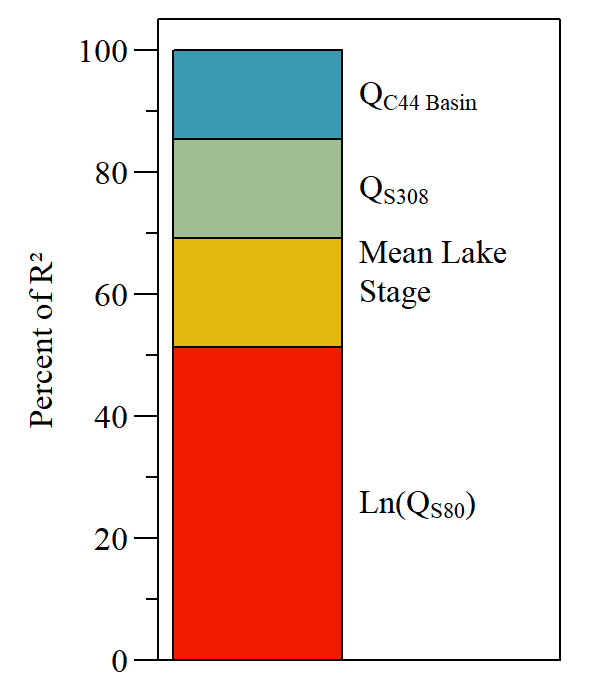
```
Relative importance of each predictor calculated by partitioning R<sup>2</sup> by averaging sequential sums of squares over all orders of regressors (Lindeman et al 1979). All metrics are normalized to a sum of 100%.

]
--
.pull-right[

Relative Importance Metrics for the S80 TN Load annual model. 

```{r}
# dput(round(rslt@lmg*100,1))
# dput(rslt@namen[2:((length(rslt@namen) - 1) + 1)])
data.frame(pred=c("Q.C44", "Q.S308", "log(Q.S80)", "mean.stg"),Per.R2=c(14.7, 16.2, 51.2, 17.9))%>%
  flextable()%>%
  fontsize(size=14,part="all")%>%
  font(fontname="Arial",part="all")%>%
  bold(part="header")%>%
  # hline_top(border = officer::fp_border(width = 1.25))%>%
  # hline_bottom(border = officer::fp_border(width = 1.25))%>%
  #hline(border = officer::fp_border(width = 1.25), part = "all")%>%
  align(j=1,align="left",part="all")%>%
  align(j=2,align="center",part="all")%>%
  compose(i=1,j=1,as_paragraph("Q",as_sub("C44")))%>%
  compose(i=2,j=1,as_paragraph("Q",as_sub("S308")))%>%
  compose(i=3,j=1,as_paragraph("ln(Q",as_sub("S80"),")"))%>%
  compose(i=4,j=1,as_paragraph("Mean Lake Stage"))%>%
  width(width=c(1.75,1.2))%>%
  set_header_labels("pred"="Predictor","Per.R2"="Percent of R\u00B2")

```

.footnote[
.small[
- Lindeman RH, Merenda PF, Gold RZ (1979) Introduction to bivariate and multivariate analysis. Scott Foresman & Co, Glenview, Illinois, USA
]]

]

---
name: S80TN_5
class: left

#### S-80 Water Quality Model (Total Nitrogen)

\begin{align*}
ln(TN Load_{S80}) = Q_{C44 Basin} +  Q_{S308} + ln(Q_{S80})+ Mean  Lake  Stage
\end{align*}

.pull-left[
```{r ,fig.align="center"}
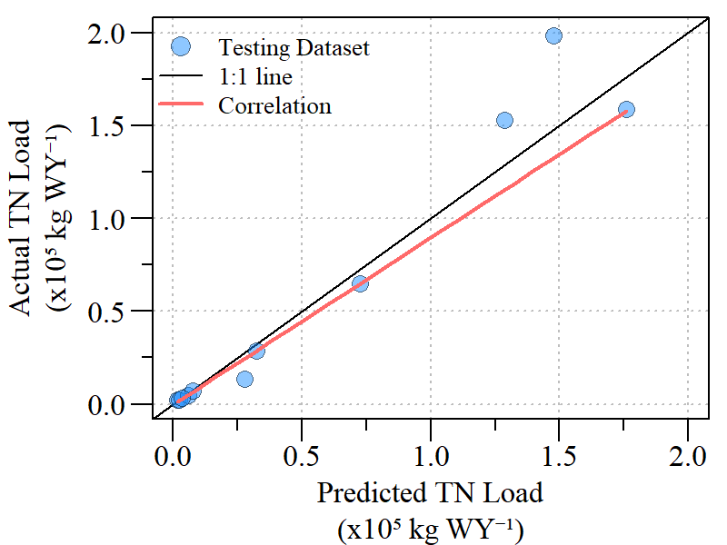
```
Actual versus predicted TN loads at S-80 based on predictive model. Actual and predicted concentration were highly correlated (Spearman’s correlation: r=0.96, $\rho$<0.01).
]

--
.pull-right[

<br>

Model Fit
  - $R^{2}_{adj}$ : 0.99
  - RSE : 0.16
  
Train:Test
  - Mean Absolute Percent Error: 22 %
  - Min-Max Accuracy: 83 %
  - Nash-Sutcliffe Coefficient: 0.93 
  - Kling-Gupta Coefficient: 0.85
]

???
Model RSE (backtransformed): 102326

Mean absolute percentage error - lower the better
Min_Max Accuracy - higher the better

---
name: S80TN_6
class: left

#### S-80 Water Quality Model (Total Nitrogen)

\begin{align*}
ln(TN Load_{S80}) = Q_{C44 Basin} +  Q_{S308} + ln(Q_{S80})+ Mean  Lake  Stage
\end{align*}


.pull-left[
```{r ,fig.align="center"}
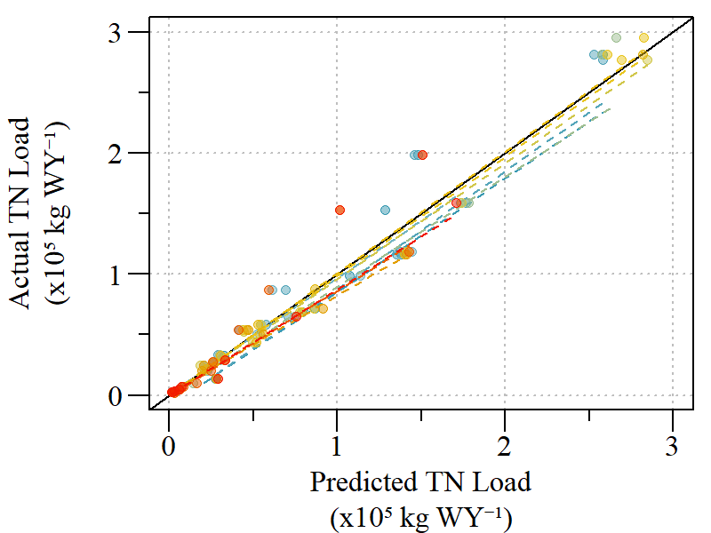
```
Actual versus predicted TN loads at S-80 with each k-model presented. 
]

--
.pull-right[
k-fold (k=10)

_Cross-validation error (average k errors)_

```{r}
data.frame(source=c(rep("Model",2),rep("Train:Test",4)),Parameter=c("R2adj","RMSE","MAPE","MMA","NS","KG"),
           Mean=c(0.97,0.19,19,85,0.93,0.88),
           Min=c(0.96,0.14,9,80,0.88,0.74),
           Max=c(0.99,0.24,26,92,0.99,0.96))%>%
  flextable()%>%
  font(fontname="Arial",part="all")%>%
  bold(part="header")%>%
  fontsize(size=13,part="header")%>%
  fontsize(size=11,part="body")%>%
  colformat_num(i=3:4,j=3:5,digits=0)%>%
  align(align="left",part="all")%>%
  align(j=3:5,align="center",part="all")%>%
  merge_v(j=1)%>%valign(j=1,valign="top")%>%
  compose(i=1,j=2,as_paragraph("R",as_sup("2"),as_sub("adj")))%>%
  width(width=c(1,1,1,1,1))%>%
  set_header_labels("source"=" ","Per.R2"="Percent of R\u00B2")%>%
  fix_border_issues()%>%
  footnote(i=3:4,j=2,part="body",
           value=as_paragraph(" Mean Absolute Percent Error (MAPE) and Min-Max Accuracy (MMA) expressed in percent"),
           ref_symbols = c(" 1"))%>%
      footnote(i=5,j=2,part="body",
           value=as_paragraph(" NS = Nash-Sutcliffe coefficient"),
           ref_symbols = c(" 2"))%>%
    footnote(i=6,j=2,part="body",
           value=as_paragraph(" KG = Kling-Gupta coefficient"),
           ref_symbols = c(" 2"))


```
  
]


---
name: WQMods
class: left

#### S-80 Water Quality Models

```{r ,fig.align="center"}
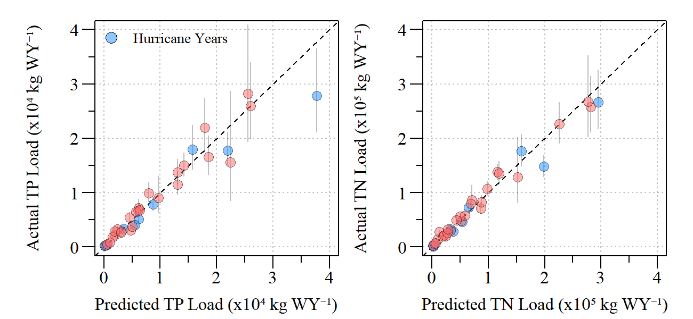
```

Annual observed versus predicted ( $\pm$ 95% CI) S-80 load during the period of record (WY1982 – WY 2019) with hurricane years identified. 

---
name: WQMods2
class: left

#### S-80 Water Quality Models

```{r ,out.width="80%",fig.align="center"}
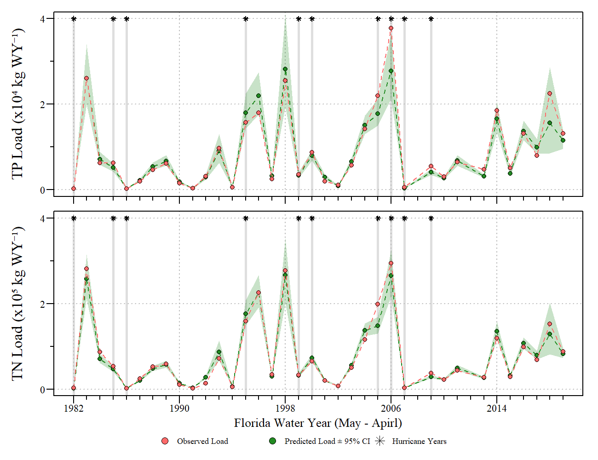
```

Annual observed versus predicted ( $\pm$ 95% CI) S-79 load during the period of record (WY1982 – WY 2019) with hurricane years identified. 

---
name: POR

#### Using monthly WQ data

.pull-left[

* Similar to CRE models, period of record monthly nutrient concentrations were considered

* Other restoration planning efforts (i.e. Restoration Strategies) have used this method in the past. 

* Evaluated by comparing observed versus estimate (i.e. "predicted") by computing RMSE


Root Mean Square Error (RMSE) 

\begin{align*}
RMSE = \sqrt{ \frac{\sum_{i=1}^{n}( X_{i} - \hat{X_{i}} )^{2} }{n} }
\end{align*}

.small[
$X_{i}$: Oberseved value

$\hat{X_{i}}$: Predicted value

$n$: Number of observations 

]

]

.pull-right[
```{r}
month.wq=read.csv(paste0(export.path,"sle_monthly_wq.csv"))

month.wq=subset(month.wq,Station.ID=="C44S80")
month.wq$mon=month.abb[month.wq$month]

month.wq$mean.TP=month.wq$mean.TP*1000
month.wq$sd.TP=month.wq$sd.TP*1000
month.wq$TP.stat=with(month.wq,paste0(round(mean.TP,0)," \u00B1 ",round(sd.TP,0)," (",N.TP,")"))
month.wq$TN.stat=with(month.wq,paste0(format(round(mean.TN,2),nsmall=2)," \u00B1 ",round(sd.TN,2)," (",N.TN,")"))
month.wq=month.wq[,c("mon","TP.stat","TN.stat")]

# cap.val="Monthly summary statistics for total phosphorus and total nitrogen observed at S-79."
flextable(month.wq)%>%
  align(j=2:ncol(month.wq),align="center",part="all")%>%
  set_header_labels("mon"="Month",
                    "TP.stat"="Total Phosphorus\n(\u03BCg L\u207B\u00B9)",
                    "TN.stat"="Total Nitrogen\n(mg L\u207B\u00B9)")%>%
  width(width=c(0.5,1.5,1.5))%>%
  footnote(i=1,j=2:3,part="header",
           value=as_paragraph(" Mean \u00B1 Std Dev (N)"),
           ref_symbols = c(" a"))%>%
  footnote(i=1,j=1,part="header",
           value=as_paragraph("POR: Jan 1981 - April 2019"),
           ref_symbols = c(" "))%>%
  footnote(i=1,j=1,part="header",
           value=as_paragraph("Station ID: C44S80"),
           ref_symbols = c(" "))%>%
  footnote(i=1,j=1,part="header",
           value=as_paragraph("Data Source: SFWMD DBHydro"),
           ref_symbols = c(" "))
  # add_header_lines(values=cap.val)%>%fontsize(size=11,part="header")
```
]

---

#### Monthly POR Estimates

- Pair monthly mean TP and TN concentrations with discharge volumes to estimate load (See [prior slide](#POR)).

```{r ,out.width="80%",fig.align="center"}
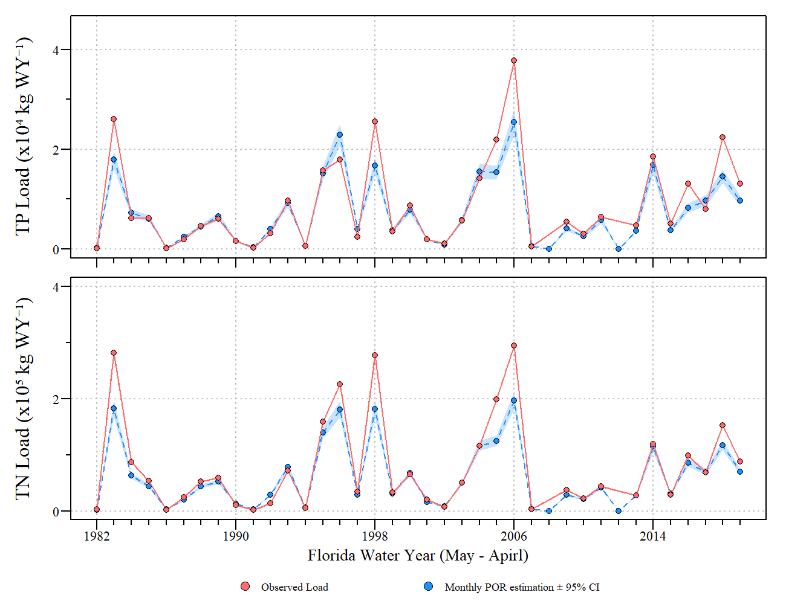
```

---

#### Monthly POR Estimates

- How does POR estimates approach match up?

.pull-left[
```{r ,out.width="100%",fig.align="center"}
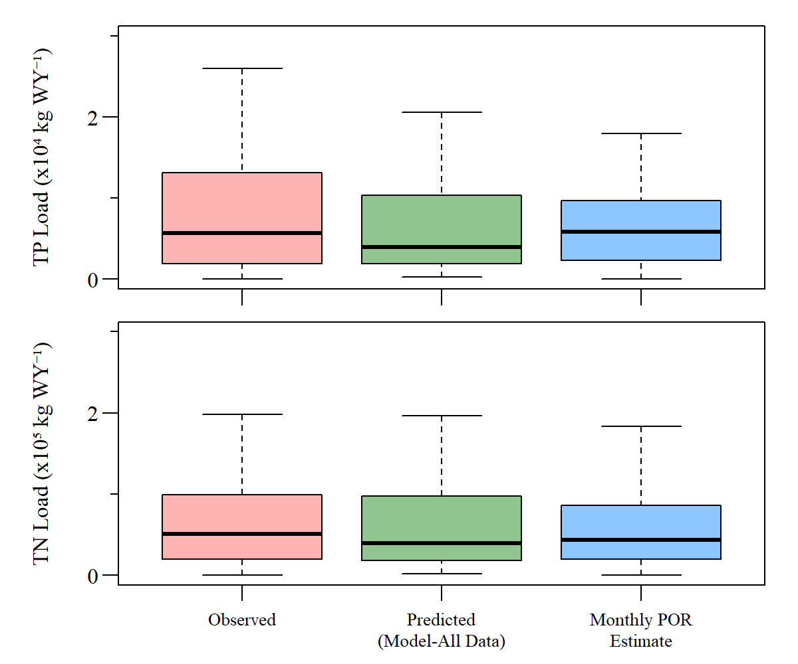
```
]

.pull-right[

```{r}
mod.RMSE=read.csv(paste0(export.path,"S80_mod_RMSEvals.csv"))

# clean-up
mod.RMSE$response=with(mod.RMSE,ifelse(response=="TPLoad","TP Load","TN Load"))
mod.RMSE=merge(mod.RMSE,data.frame(notes=c("all-data","POR"),tab.val=c("Model","POR Est.")),"notes")
mod.RMSE=mod.RMSE[,c("response","tab.val","RMSE")]
mod.RMSE=mod.RMSE[order(mod.RMSE$response,decreasing=T),]
mod.RMSE$RMSE=round(mod.RMSE$RMSE,0)

cap.val="Root mean standard error for models and period of record estimates."
flextable(mod.RMSE)%>%
  fontsize(size=13,part="header")%>%
  fontsize(size=11,part="body")%>%
  align(align="left",part="all")%>%
  merge_v(j=1)%>%valign(j=1,valign="top")%>%
  set_header_labels("response"="Model",
                    "tab.val"="Estimate Method")%>%
  width(width=c(1,1.5,0.75))%>%
  fix_border_issues()%>%
  footnote(i=1,j=3,part="header",
           value=as_paragraph(" RMSE value for POR Est. calculated using observed values versus annual estimated values using monthly mean concentrations"),
           ref_symbols = c(" A"))%>%
  footnote(i=1,j=3,part="header",
           value=as_paragraph(" RMSE value for Model - All Data backcalculated on untransformed predicted and observed values"),
           ref_symbols = c(" B"))%>%
  add_header_lines(values=cap.val)%>%fontsize(size=11,part="header")

```

]

---

#### S-80 Water Quality Models

```{r ,out.width="80%",fig.align="center"}
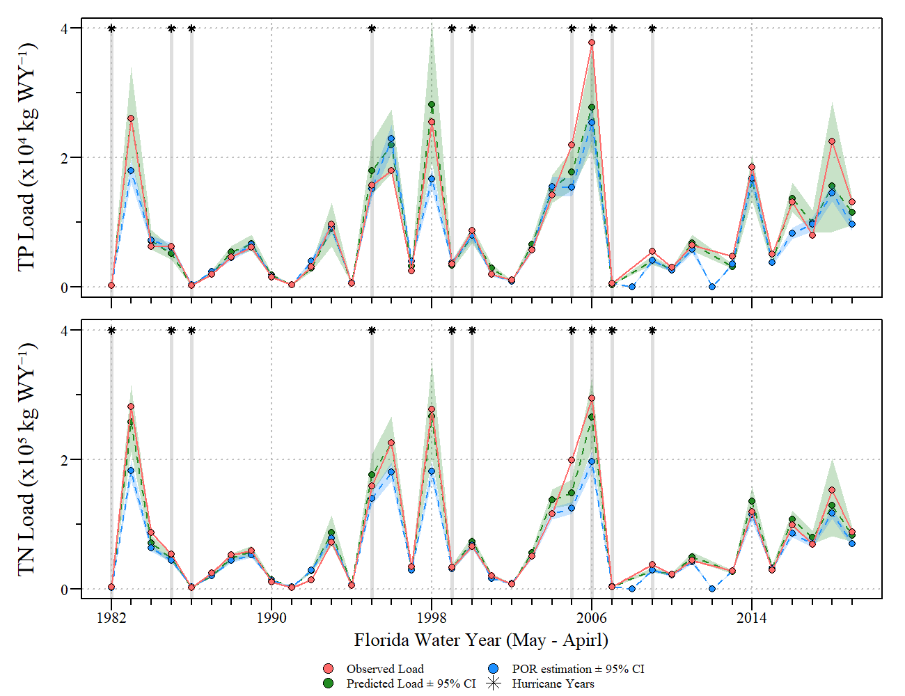
```

Comparison of observed, modelled and period of record estimated nutrient loads at S-80 between Florida Water Year 1982 - 2019 (May 1981 - April 2019).

---

#### S-80 Water Quality Models

```{r ,out.width="80%",fig.align="center"}
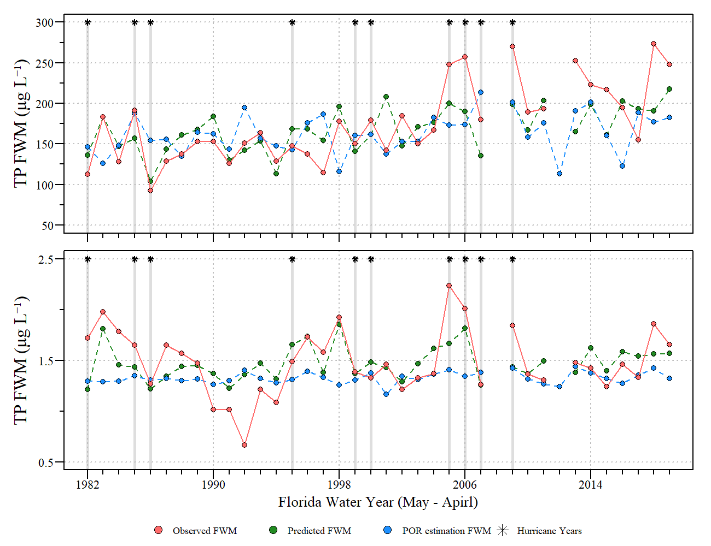
```

Comparison of observed, modelled and period of record estimated nutrient flow-weighted mean at S-80 between Florida Water Year 1982 - 2019 (May 1981 - April 2019).

---
name: RSM
class: left

#### S-80 Water Quality Models

**Application of model with RSM-BN outputs<sup>1</sup>**

```{r RSM,out.width="80%",fig.align="center"}
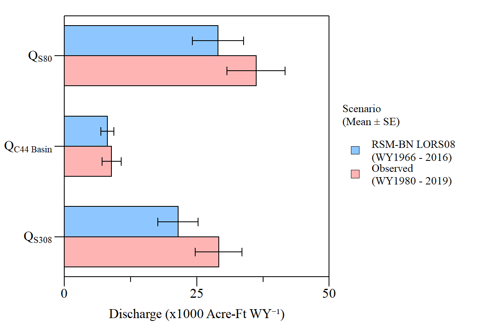
```


.footnote[
.small[
<sup>1</sup>Provisional RSM BN outputs with POR extension. For demonstration/testing purposes only.
]
]

---
name: RSM2
class: left

#### S-80 Water Quality Models

**Application of model with RSM-BN outputs<sup>1</sup>**

```{r RSM Nutrient,out.width="65%",fig.align="center"}
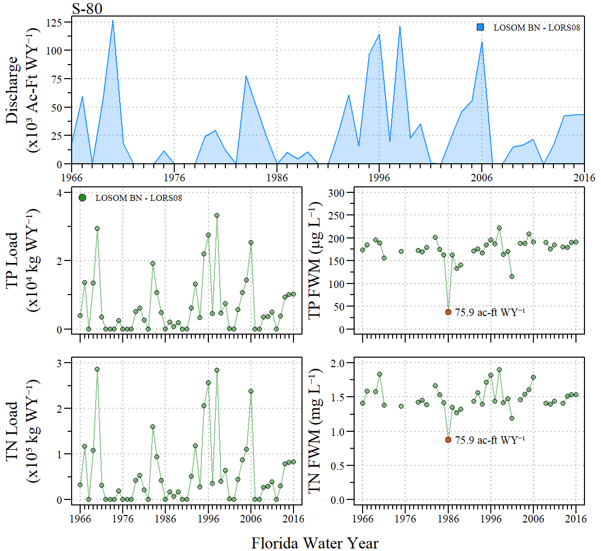
```

.footnote[
.small[
<sup>1</sup>Provisional RSM BN outputs with POR extension. For demonstration/testing purposes only.
]
]

---
name: RSMeval
class:left

#### RSM Evalution

- Compare loading conditions of selected alternatives to some base conditions (i.e. ECB, LORS08, etc).

- Both models assume that C43 and C44 Reservoirs are providing temporary storage of existing/available water. 

- Both models do not incorporate potential water quality treatment features
    - CRE: C43 Water Quality Feasibility Study project.
    - SLE: C44 Reservoir and STA.
    
- To evalute potential WQ improvements loading could be evaluated post processing in a Monte-Carlo like evaluation assuming a degree of treatment (i.e. % reduction, $X$ metric tons, etc.). 

<!--  
\begin{align*}
f_{treatment}(WY_{i}) = ENLM TP_{WY=i} \times treatment_{N(\mu ,\sigma^2)}
\end{align*}
--> 

---
name: last slide
class: left

### Acknowledgements

#### Data

```{r ,out.width="10%"}
knitr::include_graphics("https://www.sfwmd.gov/sites/default/files/documents/sfwmd-seal-hq.png")
```
South Florida Water Management District ([DBHYDRO](https://www.sfwmd.gov/science-data/dbhydro))


#### Slides

* HTML [Slide deck](https://owper-tech.github.io/slides/LOSOM/Julian_LOSOM_SLE_ENLM.html) &copy; Julian (2020) [](http://creativecommons.org/licenses/by/4.0/)

* RMarkdown [Source](https://github.com/SwampThingPaul/LOSOM_ENLM)

<br>

```{r ,out.width="15%",fig.align="center"}
knitr::include_graphics("https://floridadep.gov/system/files/styles/general_page_images__scaled_to_900_pixels_/private/media-folders/media-root/in-house-graphic-DEP%20Logo%20color%20Large.png?itok=wm1GoIhx")
```
<center><font color="red">Draft FDEP Work Product</font></center>


---
class: inverse

<!-- Blank Slide between presentation and extra slides -->

---
name: TP_diag


**S80 TP Model diagnostics**

.pull-left[

```{r ,fig.align="center"}
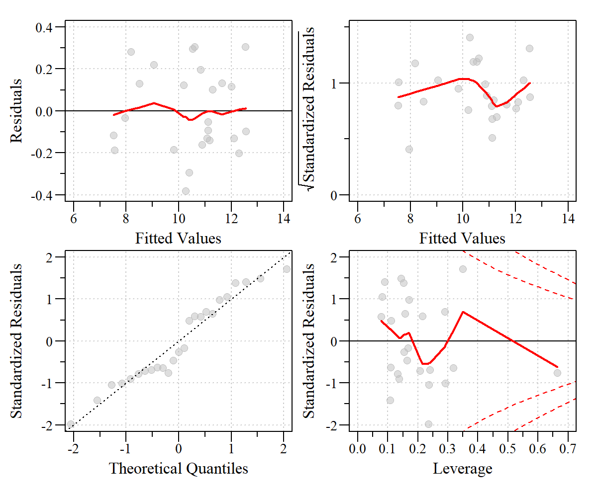
```
.small[S80 TP model diagnostics plots (Top Left: Residuals vs Fitted, Bottom Left: Normal Q-Q, Top Right: Scale-Location, Bottom right: Residuals vs leverage.).]

.small[

- GVLMA (Global Stats = 1.75, $\rho$ =0.78)

- Shapiro-Wilk normality test (W=0.94, $\rho$ =0.12)

]

]

.pull-right[

```{r ,out.width="100%",fig.align="center"}
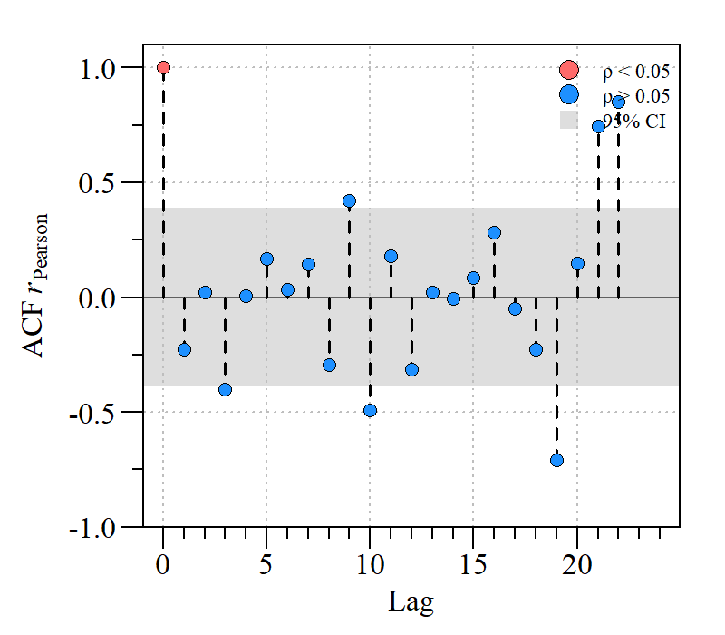
```
.small[S80 TP Model residual Autocorrelation Function.]
<br>

.small[

- Breusch-Godfrey (LM test = 1.58, df = 1, $\rho$=0.21)

]

]

.footnote[
.small[[TP Model](#S80TP_3) plots]
]

---
name: TN_diag


**S80 TN Model diagnostics**

.pull-left[

```{r ,fig.align="center"}
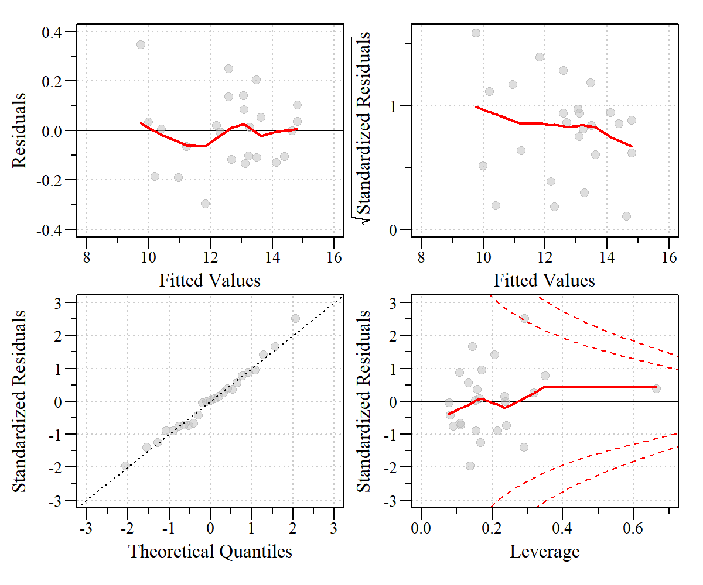
```
.small[S80 TN model diagnostics plots (Top Left: Residuals vs Fitted, Bottom Left: Normal Q-Q, Top Right: Scale-Location, Bottom right: Residuals vs leverage.).]

.small[

- GVLMA (Global Stats = 6.68, $\rho$ =0.27)

- Shapiro-Wilk normality test (W=0.98, $\rho$ =0.92)

]

]

.pull-right[

```{r ,out.width="100%",fig.align="center"}
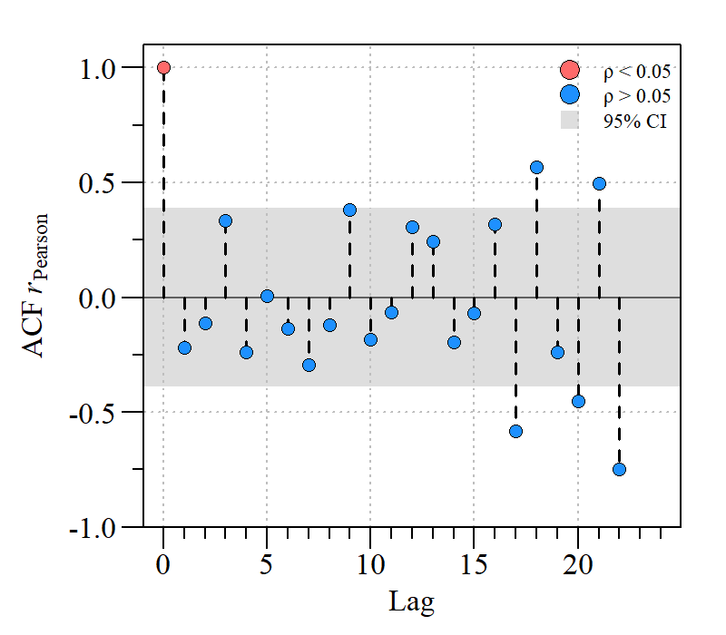
```
.small[S80 TN Model residual Autocorrelation Function.]
<br>

.small[

- Breusch-Godfrey (LM test = 1.20, df = 1, $\rho$=0.27)

]

]

.footnote[
.small[[TN Model](#S80TN_3) plots]
]

---
name: EffCoef

#### Model Efficiency Coefficient

**Nash-Sutcliffe**
.pull-left[

\begin{align*}
NS = 1- \frac{\sum_{t=1}^{n} (X_{s,t} - X_{o,t})^2}{\sum_{t=1}^{n} (X_{o,t} - \mu_{o})^2}
\end{align*}

]
.pull-right[
.small[

$n$ : total number of time-steps <br>
$X_{s,t}$ : simulated value at timestep $t$ <br>
$X_{o,t}$ : observed value at timestep $t$ <br>
$\mu_{o}$ : mean of observed values <br>
]

The ratio of error variance of the modeled versus observed timeseries
]

**Kling-Gupta**

\begin{align*}
KG = 1- \sqrt{(r_{pearson}-1)^{2} + \left(\frac{\sigma_{s}}{\sigma_{o}}-1 \right)^{2} + \left(\frac{\mu_{s}}{\mu_{o}}-1 \right)^2}
\end{align*}

.pull-left[
.small[
$r_{pearson}$ : Pearson correlation coefficient <br>
$\mu_{s}$ : mean of simulated values <br>
$\sigma_{o}$ : standard deviation of observed values <br>
$\sigma_{s}$ : standard deviation of simulated values <br>
]
]
.pull-right[
Decomposition of NS representing the degree of correlation, bias and variablity of simulated and observed values. 
]

.footnote[
.small[[Return](#S80TP_6)]
]