```{r xaringanExtra, include=FALSE, warnint=FALSE}
# devtools::install_github("gadenbuie/xaringanExtra")
# xaringanExtra::use_webcam()
xaringanExtra::use_tile_view()
# xaringanExtra::use_scribble()
# xaringanExtra::use_progress_bar("red", "bottom","0.25em")
```

```{r setup, include=FALSE}
library(knitr)

options(htmltools.dir.version = FALSE)
knitr::opts_chunk$set(warning = FALSE, message = FALSE, echo=FALSE)

##
library(flextable)
library(magrittr)
library(plyr)
library(reshape2)

wd="C:/Julian_LaCie/_GitHub/LOSOM_ENLM"

plot.path=paste0(wd,"/plots")
export.path=paste0(wd,"/Export")

# plot.figs=list.files(plot.path,full.names=T)
# slides.figs=paste0(wd,"slides/plots")
# file.copy(plot.figs,slides.figs,overwrite=T,recursive=T)

## Functions
notidy_glance_lm=function(model,...){
  # check whether the model was fitted with only an intercept, in which
  # case drop the fstatistic related columns
  int_only <- nrow(summary(model)$coefficients) == 1
  
  with(
    summary(model),
    data.frame(
      r.squared = r.squared,
      adj.r.squared = adj.r.squared,
      sigma = sigma,
      statistic = if (!int_only) {fstatistic["value"]} else {NA},
      p.value = if (!int_only) {
        pf(
          fstatistic["value"],
          fstatistic["numdf"],
          fstatistic["dendf"],
          lower.tail = FALSE
        )
      } else {NA},
      df = if (!int_only) {fstatistic["numdf"]} else {NA},
      logLik = as.numeric(stats::logLik(model)),
      AIC = stats::AIC(model),
      BIC = stats::BIC(model),
      deviance = stats::deviance(model),
      df.residual = df.residual(model),
      nobs = stats::nobs(model)
    )
  )
}

notidy_tidy_lm <- function(model, conf.int = FALSE, conf.level = 0.95, ...) {
  
  ret <- data.frame(summary(model)$coefficients)
  ret$term<-rownames(ret)
  rownames(ret)=NULL
  ret<-ret[,c(5,1:4)]
  colnames(ret) <- c("term", "estimate", "std.error", "statistic", "p.value")
  
  if(conf.int){
    ci <- confint(model,level=conf.level)
    ci <- data.frame(ci)
    ci$term<-rownames(ci)
    rownames(ci)=NULL
    ci<-ci[,c(3,1,2)]
    names(ci)<- c("term","conf.low","conf.high")
    
    ret<-merge(ret,ci,"term")
  }
  ret
}

# data_t=notidy_tidy_lm(mod.TN)
# data_g=notidy_glance_lm(mod.TN)

notidy_as_flextable<-function(x,data_t=NULL,data_g=NULL,dig.num=2,sigma.form="d",r2dig=2,alpha.val=0.01,sig.code=FALSE,...){
 # needs flextable

    pvalue_format <- function(x){
    z <- cut(x, breaks = c(-Inf, 0.001, 0.01, 0.05, 0.1, Inf), labels = c("***", "**", "*", ".", ""))
    as.character(z)
    }
  
  if(class(x)=="lm"&is.null(data_t)&is.null(data_g)){
  data_t <- notidy_tidy_lm(x)
  data_g <- notidy_glance_lm(x)
  }
  
  if(sig.code==TRUE){
    ft <- flextable(data_t, col_keys = c("term", "estimate", "std.error", "statistic", "p.value", "signif"))
    # ft <- colformat_num(ft, j = c("estimate", "std.error", "statistic"), digits = dig.num)
    ft <- colformat_double(ft, j = c("estimate", "std.error", "statistic"), digits = dig.num,big.mark = "")
    # ft <- colformat_num(ft, j = c("p.value"), digits = dig.num)
    ft <- colformat_double(ft, j = c("p.value"), digits = dig.num,big.mark = "")
    ft <- compose(ft, j = "signif", value = as_paragraph(pvalue_format(p.value)) )
    ft <- set_header_labels(ft, term = "", estimate = "Estimate",
                          std.error = "Standard Error", statistic = "t-value",
                          p.value = "\u03C1-value", signif = "" )
    dimpretty <- dim_pretty(ft, part = "all")
  
  ft <- add_footer_lines(ft, values = c(
    "Signif. codes: 0 \u2264 '***' < 0.001 < '**' < 0.01 < '*' < 0.05 < '.' < 0.1 < ' ' < 1",
    "",
    sprintf("Residual standard error: %s on %.0f degrees of freedom", formatC(data_g$sigma,format=sigma.form), data_g$df.residual),
    sprintf("Multiple R-squared: %s, Adjusted R-squared: %s", formatC(data_g$r.squared,digits = r2dig,format="f"), formatC(data_g$adj.r.squared,digits = r2dig,format="f")),
     paste0("F-statistic: ",formatC(data_g$statistic)," on ",data_g$df.residual, " and ",data_g$df, ", \u03C1-value:",ifelse(data_g$p.value<alpha.val,paste("\u2264",alpha.val),format(round(p.value,2),nsmall=2)))
  ))
  }else{
    data_t$p.value<-with(data_t,ifelse(p.value<=alpha.val,paste0("\u2264 ",alpha.val),format(round(p.value,2),nsmall=2))) 
    data_g$p.value<-with(data_g,ifelse(p.value<=alpha.val,paste0("\u2264 ",alpha.val),format(round(p.value,2),nsmall=2)))
    
    ft <- flextable(data_t, col_keys = c("term", "estimate", "std.error", "statistic", "p.value", "signif"))
    ft <- colformat_num(ft, j = c("estimate", "std.error", "statistic"), digits = dig.num)
    # ft <- colformat_num(ft, j = c("p.value"), digits = dig.num)
    ft <- set_header_labels(ft, term = "", estimate = "Estimate",
                          std.error = "Standard Error", statistic = "t-value",
                          p.value = "\u03C1-value", signif = "" )
    dimpretty <- dim_pretty(ft, part = "all")
  
  ft <- add_footer_lines(ft, values = c(
    "",
    sprintf("Residual standard error: %s on %.0f degrees of freedom", formatC(data_g$sigma,format=sigma.form), data_g$df.residual),
    sprintf("Multiple R-squared: %s, Adjusted R-squared: %s", formatC(data_g$r.squared,digits = r2dig,format="f"), formatC(data_g$adj.r.squared,digits = r2dig,format="f")),
    paste0("F-statistic: ",formatC(data_g$statistic)," on ",data_g$df.residual, " and ",data_g$df, ", \u03C1-value: ",data_g$p.value)
    ))
  }
  ft <- align(ft,j=5,align="right")
  ft <- align(ft,j=5,align="right",part="all")
  ft <- align(ft, i = 1, align = "right", part = "footer")
  ft <- italic(ft, i = 1, italic = TRUE, part = "footer")
  ft <- hrule(ft, rule = "auto")
  ft <- autofit(ft, part = c("header", "body"))
  ft
}

```

layout: true

---
name: title
class: left, middle

### Caloosahatchee Estuary Nutrient Loading Model

`r paste(format(as.Date("2022-02-09"),"%B %d, %Y"))#,"<br>(Updated:", format(as.Date(Sys.Date()),"%B %d, %Y"),")")`


<!-- this ends up being the title slide since seal = FALSE-->


.footnote[
Paul Julian PhD [`r fontawesome::fa("fas fa-envelope")`](mailto: pauljulianphd@gmail.com) .small[pauljulianphd@gmail.com]

.small[Use cursor keys for navigation, press .red["O"] for a slide .red[O]verview]

```{r} 
bsplus::bs_button(
    label = "Download PDF Version",
    button_type = "primary",
    button_size = "small") %>%
    htmltools::a(
      href = "https://swampthingecology.org/LOSOM_ENLM/slides/20220209_CRE_ENLM.pdf"
      )
```
]

---
name: land acknowledge
background-image: url("plots/cre_mural1.png")
background-position: center
background-size: contain
class: middle

## Land Acknowledgement

<div class="box box2">
.large[The land on which we sit have been cared for by innumerable generations of original peoples of the past, whose memory we honor. The 2009 US apology to native peoples inaugurated an American context of reconciliation, which is an opportunity for healing, collaboration, and environmental conservation.]
</div>

.footnote[
.small[
* [https://nativegov.org/news/a-guide-to-indigenous-land-acknowledgment/
](https://nativegov.org/news/a-guide-to-indigenous-land-acknowledgment/
)]
.small[* [2009 US Apology](https://www.congress.gov/bill/111th-congress/senate-joint-resolution/14/text)
]
]

---
name: EstuaryLoading

### Estuary Dynamics

```{r ,fig.align="center",out.width="50%",fig.cap="Conceptual diagram of shallow coastal ecosystems from Coles et al (2007)."}
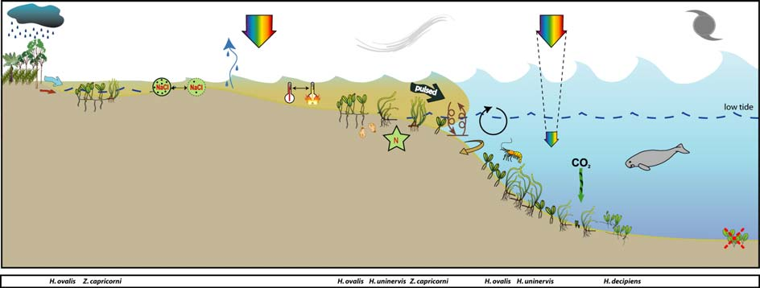
```

* Changes in estuarine biogeochemistry and ecological function is driven largely by magnitude and composition of freshwater inputs.

--

.pull-left[
.small[
* Upstream nutrient loading to the estuary can be a stressor that can promote algal biomass (i.e. Chl-a) leading to decreased light attenuation and degraded benthic communities.

* Coastal nutrient loading can also promote marco- and epiphytic algae that can directly/indirectly impact seagrass communities (Madden et al 2009)
]
]

--

.pull-right[
.small[
* Freshwater inputs can also depress salinity at increase colored dissolved organic matter thereby reducing light attenuation (Chen et al 2015).
]
```{r ,fig.align="center",out.width="80%"}
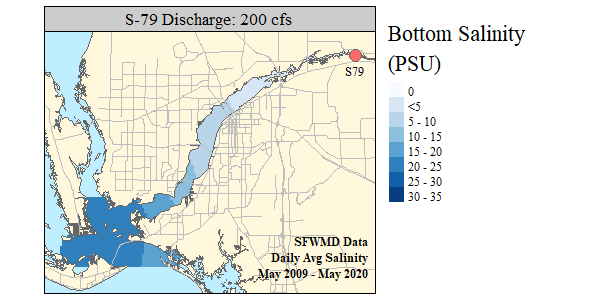
```

]

---
name: EstuaryLoading2

### Estuary Nutrient Loading

...and ecological response

```{r ,fig.align="center",out.width="50%",fig.cap="Conceptual model of Florida Bay, SAV-phytoplankton ecosystem (Madden et al 2009; Glibert et al 2010)."}
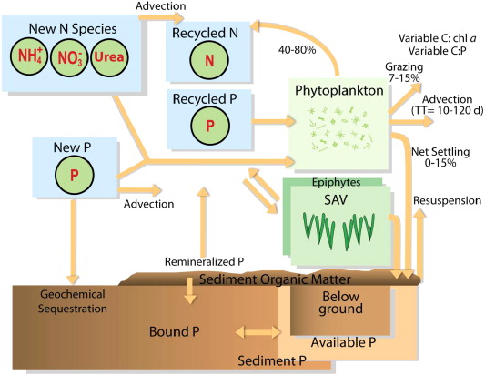
```

* Seagrass Ecosystem Assessment and Community Organization Model (SEACOM)
  * mechanistic simulation model of seagrass–water column interactions on an ecosystem scale describing the biomass, production, composition and distribution of submersed aquatic vegetation and phytoplankton
  
---
name: why

```{r ,fig.align="center",out.width="90%"}
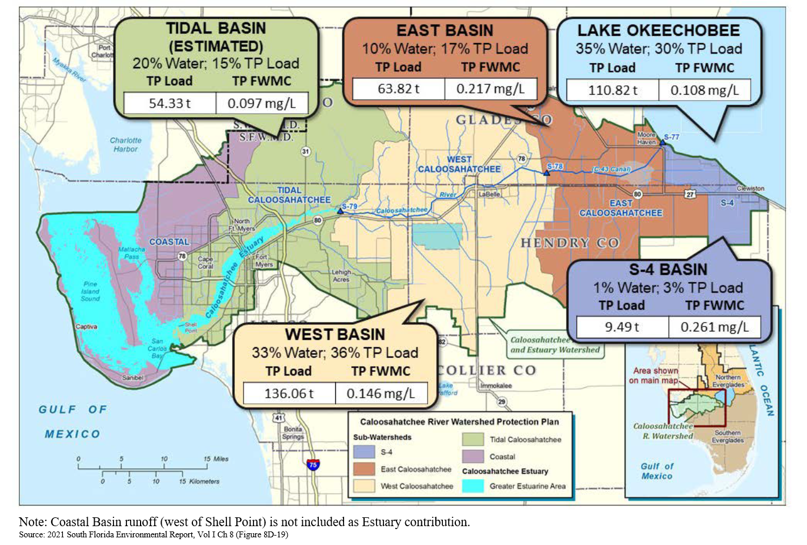
```

Local Basin Runoff accounts for approximately:
  * 64% of flow, 
  * 71% TP load, and 
  * 61% TN load (not shown)

to estuary (May 2015 - April 2020; WY2016-2020).

---
name: why2

### Objective

Due to ongoing planning efforts the goal was to develop a series of water quality models based on hydrodynamic indicators to be used in planning model scenario evaluation using RSMBN.

--
### Methods

- __Period of Record:__ May 1981 – April 2019 (WY1982 – 2019)
  - Based on available data.
  
--

- __Parameters of Interest:__ Total Phosphorus and Total Nitrogen.

--

- __Predictor Variables:__ Discharge (S77 and C43 Basin) and Lake Okeechobee stage elevation.

--

- __Statistical Modeling:__
  - Multiple regression models using training and testing datasets (70:30). 
     - Training dataset: randomly sampled 70% of monthly data 
     - Testing dataset: remaining 30% was used for model testing
  - Verified with k-fold cross-validation linear modeling. 


---
name: context

### Interesting Period

```{r ,fig.align="center",out.width="75%",fig.cap="Observed Atlantic Multidecadal Oscillation (AMO) index time-series. Adapted and updated from Enfield et al (2001)." }
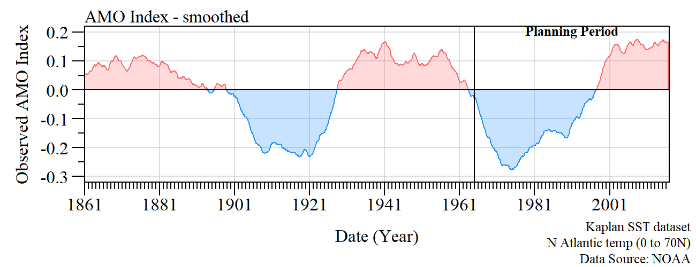
```


```{r ,fig.align="center",out.width="90%",fig.cap="Lake Okeechobee Regulation Schedule History." }
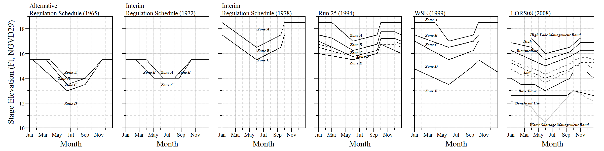
```

???
AMO Index: https://psl.noaa.gov/data/timeseries/AMO/

1. Use the Kaplan SST dataset (5x5).
2. Compute the area weighted average over the N Atlantic, basically 0 to 70N.
3. Detrend that time series
4. Optionally smooth it with a 121 month smoother.


---
name: context

### Interesting Period

```{r ,fig.align="center",out.width="50%",fig.cap="C-43 basin average cumulative rainfall versus S-79 cumulative flow from WY1979 to WY2016 (May 1, 1978–April 30, 2016; Julian & Osborne 2018)" }
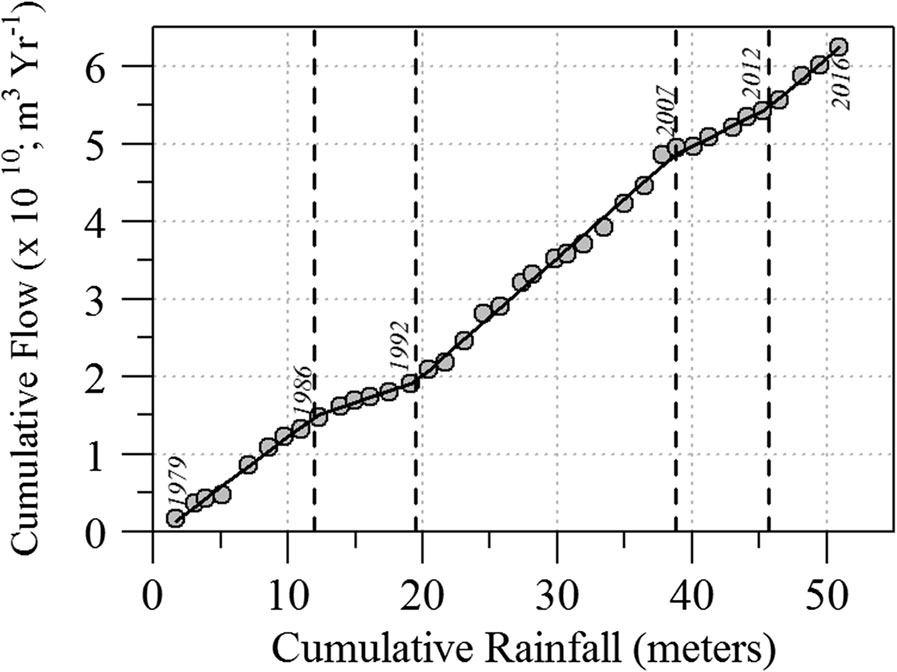
```

---
name: S79TP
class: left

### S-79 Water Quality Model (Total Phosphorus)

```{r S79TP,fig.align="center"}
knitr::include_graphics('./plots/S79_TP.png')
```

<!-- WY1979 - 2016 (Julian and Osborne 2016) -->

<!-- * No significant (annual) trend in S-79 Discharge or TP FWM -->

---
name: S79TPMod
class: left

### S-79 Water Quality Model (Total Phosphorus)
- No data transformations needed to fit the assumptions of linear modeling

--

- Model assumptions and verified
  - GVLMA (Global Stats = 3.36, $\rho$=0.50)
  
- Variance inflation factors (VIF) evaluated for model

- Residuals check for autocorrelation (Breusch-Godfrey test)
  - Breusch-Godfrey (LM test = 0.06, df = 1, $\rho$=0.80)

--

- Final Model:
\begin{align*}
TP Load_{S79} = Q_{C43 Basin} +  Q_{S77} + Mean  Lake  Stage
\end{align*}


.footnote[
.small[[Model Diagnostics](#TP_diag) plots]
]


---
name: S79TPmod2

### S-79 Water Quality Model (Total Phosphorus)

\begin{align*}
TP Load_{S79} = 127156 + 0.20 Q_{C43 Basin} + 0.08 Q_{S77} - 7689 Mean  Lake  Stage
\end{align*}

```{r}
mod.est=read.csv(paste0(export.path,"/model_estimates.csv"))
mod.sum=read.csv(paste0(export.path,"/model_summary.csv"))
mod.sum$DF.f=with(mod.sum,paste(df,df.residual,sep=", "))

cap.val="S-79 total phosphorus model results and estimates fitted using all available data during the water year 1982 - 2019 period."
notidy_as_flextable(x=NULL,data_g=subset(mod.sum,response=="TPLoad"&note=="all-data"),
                    data_t=subset(mod.est,response=="TPLoad"&note=="all-data"))%>%
  colformat_double(j = c("estimate", "std.error", "statistic"), digits=2,big.mark="")%>%
  colformat_double(j = c("p.value"), digits = 2,big.mark = "")%>%
  compose(i=2,j=1,as_paragraph("Q",as_sub("C43")))%>%
  compose(i=3,j=1,as_paragraph("Q",as_sub("S77")))%>%
  compose(i=4,j=1,as_paragraph("Mean Lake Stage"))%>%
  width(width=c(1.5,1.2,1.2,1.2,1.2,0.1))%>%
  padding(padding=0.5)%>%
  fontsize(size=12,part="header")%>%
  fontsize(size=11,part="body")%>%
  align(j=2:5,align="center",part="all")%>%
  add_header_lines(values=cap.val)%>%fontsize(size=13,part="header")
```


.footnote[
.small[[Model Diagnostics](#TP_diag) plots]
]


---
name: S79TP_eval1
class: left
exclude: true

### S-79 Water Quality Model (Total Phosphorus)

\begin{align*}
TP Load_{S79} = Q_{C43 Basin} +  Q_{S77} + Mean  Lake  Stage
\end{align*}


.pull-left[
```{r ,fig.align="center"}
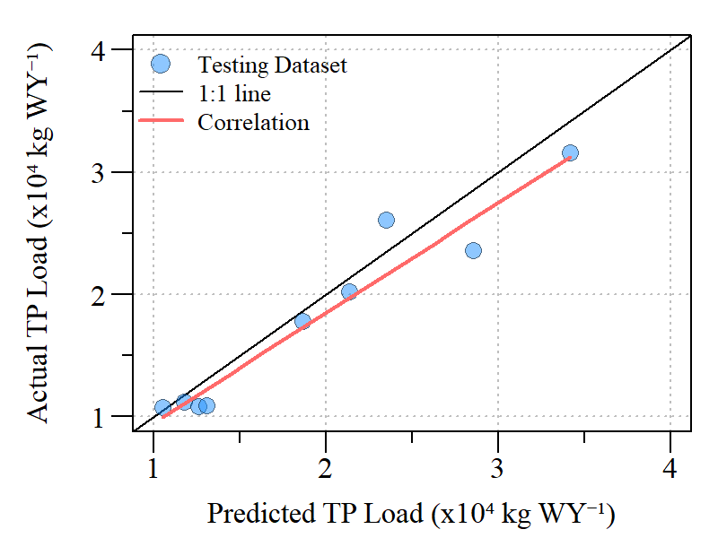
```
Actual versus predicted TP loads at S-79 based on predictive model. Actual and predicted concentration were highly correlated (Spearman’s correlation: r=0.98, $\rho$<0.01).
]

--
exclude: true

.pull-right[

<br>

Model Fit
  - $R^{2}_{adj}$ : 0.78
  - RSE : 49112
  
Train:Test
  - Mean Absolute Percent Error: 15 %
  - Min-Max Accuracy: 87 %

]

???
Mean absolute percentage error - lower the better
Min_Max Accuracy - higher the better

---
name: S79TP_eval2
class: left

### S-79 Water Quality Model (Total Phosphorus)

\begin{align*}
TP Load_{S79} = Q_{C43 Basin} +  Q_{S77} + Mean  Lake  Stage
\end{align*}


.pull-left[
```{r ,fig.align="center"}
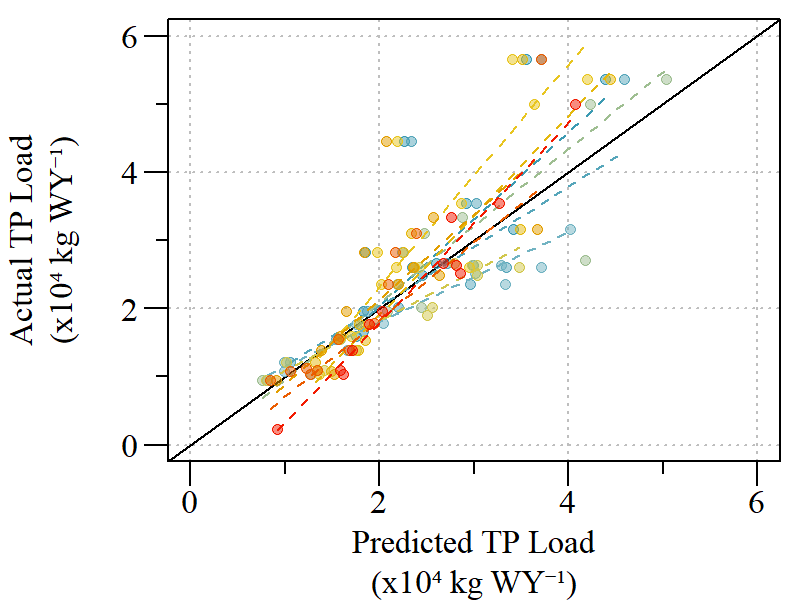
```
Actual versus predicted TP loads at S-79 with each k-model presented. 
]

--
.pull-right[
k-fold (k=10)

_Cross-validation error (average k errors)_

```{r}
data.frame(source=c(rep("Model",2),rep("Train:Test",2)),Parameter=c("R2adj","RMSE","MAPE","MMA"),
           Mean=c(0.71,63461,21,83),
           Min=c(0.62,41657,16,78),
           Max=c(0.79,76864,41,86))%>%
  flextable()%>%
  font(fontname="Arial",part="all")%>%
  bold(part="header")%>%
  fontsize(size=13,part="header")%>%
  fontsize(size=11,part="body")%>%
  colformat_num(i=2:4,j=3:5,digits=0)%>%
  align(align="left",part="all")%>%
  align(j=3:5,align="center",part="all")%>%
  merge_v(j=1)%>%valign(j=1,valign="top")%>%
  compose(i=1,j=2,as_paragraph("R",as_sup("2"),as_sub("adj")))%>%
  width(width=c(1,1,1,1,1))%>%
  set_header_labels("source"=" ","Per.R2"="Percent of R\u00B2")%>%
  fix_border_issues()%>%
  footnote(i=3:4,j=2,part="body",
           value=as_paragraph(" Mean Absolute Percent Error (MAPE) and Min-Max Accuracy (MMA) expressed in percent"),
           ref_symbols = c(" 1"))

```


]

---
name: S79TP_eval3
class: left

### S-79 Water Quality Model (Total Phosphorus)


\begin{align*}
TP Load_{S79} = Q_{C43 Basin} +  Q_{S77} + Mean  Lake  Stage
\end{align*}

.pull-left[
```{r out.width="70%",fig.align="center"}
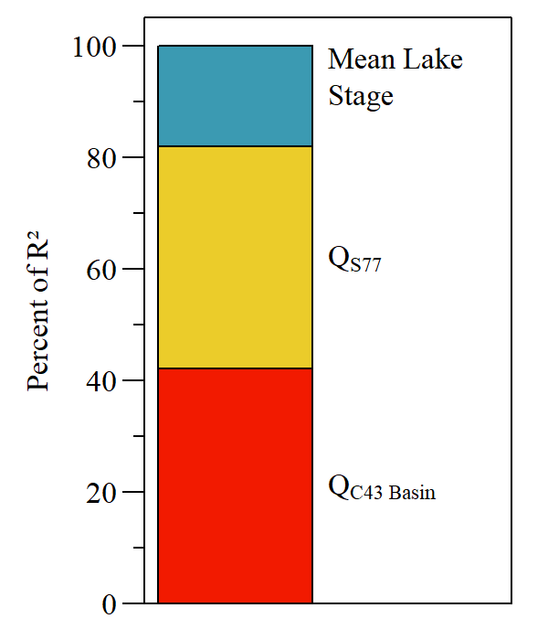
```
Relative importance of each predictor calculated by partitioning R<sup>2</sup> by averaging sequential sums of squares over all orders of regressors (Lindeman et al 1979). All metrics are normalized to a sum of 100%.

]

.pull-right[

Relative Importance Metrics for the S79 TP Load annual model. 

```{r}
data.frame(pred=c("QC43","QS77","Stage"),Per.R2=c(46.5,21.0,32.3))%>%
  flextable()%>%
  fontsize(size=14,part="all")%>%
  font(fontname="Arial",part="all")%>%
  hline_top(border = officer::fp_border(width = 1.25))%>%
  hline_bottom(border = officer::fp_border(width = 1.25))%>%
  #hline(border = officer::fp_border(width = 1.25), part = "all")%>%
  align(j=1,align="left",part="all")%>%
  align(j=2,align="center",part="all")%>%
  compose(i=1,j=1,as_paragraph("Q",as_sub("C43")))%>%
  compose(i=2,j=1,as_paragraph("Q",as_sub("S77")))%>%
  compose(i=3,j=1,as_paragraph("Mean Lake Stage"))%>%
  width(width=c(1.75,1.2))%>%
  set_header_labels("pred"="Predictor","Per.R2"="Percent of R\u00B2")%>%
  footnote(i=1,j=2,part="header",
           value=as_paragraph(" Model R\u00B2: 0.78 (Adjusted R\u00B2)"),
           ref_symbols = c(" "))


```
]


---
name: S79TN
class: left

### S-79 Water Quality Model (Total Nitrogen)

```{r S79TN,fig.align="center"}
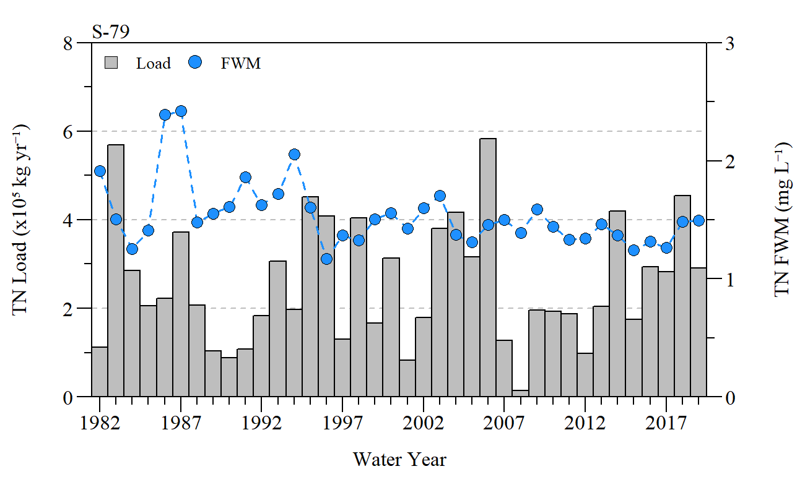
```

---
name: S79TNMod
class: left

### S-79 Water Quality Model (Total Nitrogen)
- No data transformations needed to fit the assumptions of linear modeling

--

- Model assumptions and verified
  - GVLMA (Global Stats = 4.77, $\rho$=0.31)
  
- Variance inflation factors (VIF) evaluated for model

- Residuals check for autocorrelation (Breusch-Godfrey test)
  - Breusch-Godfrey (LM test = 0.73, df = 1, $\rho$=0.39)

--

- Final Model:
\begin{align*}
TN Load_{S79} = Q_{C43 Basin} +  Q_{S77} + Mean  Lake  Stage
\end{align*}


.footnote[
.small[[Model Diagnostics](#TN_diag) plots]
]

---
name: S79TNMod2
class: left

### S-79 Water Quality Model (Total Nitrogen)

\begin{align*}
TN Load_{S79} = 27561 + 1.53 Q_{C43 Basin} + 1.58 Q_{S77} + 20813 Mean  Lake  Stage
\end{align*}

```{r}
cap.val="S-79 total nitrogen model results and estimates fitted using all available data during the water year 1982 - 2019 period."
notidy_as_flextable(x=NULL,data_g=subset(mod.sum,response=="TNLoad"&note=="all-data"),
                    data_t=subset(mod.est,response=="TNLoad"&note=="all-data"))%>%
  colformat_double(j = c("estimate", "std.error", "statistic"), digits=2,big.mark="")%>%
  colformat_double(j = c("p.value"), digits = 2,big.mark = "")%>%
  compose(i=2,j=1,as_paragraph("Q",as_sub("C43")))%>%
  compose(i=3,j=1,as_paragraph("Q",as_sub("S77")))%>%
  compose(i=4,j=1,as_paragraph("Mean Lake Stage"))%>%
  width(width=c(1.5,1.2,1.2,1.2,1.2,0.1))%>%
  padding(padding=0.5)%>%
  fontsize(size=13,part="header")%>%
  fontsize(size=11,part="body")%>%
  align(j=2:5,align="center",part="all")%>%
  add_header_lines(values=cap.val)%>%fontsize(size=13,part="header")


```


---
name: S79TN_eval1
class: left
exclude: true

### S-79 Water Quality Model (Total Nitrogen)

\begin{align*}
TN Load_{S79} = Q_{C43 Basin} +  Q_{S77} + Mean  Lake  Stage
\end{align*}


.pull-left[
```{r ,fig.align="center"}
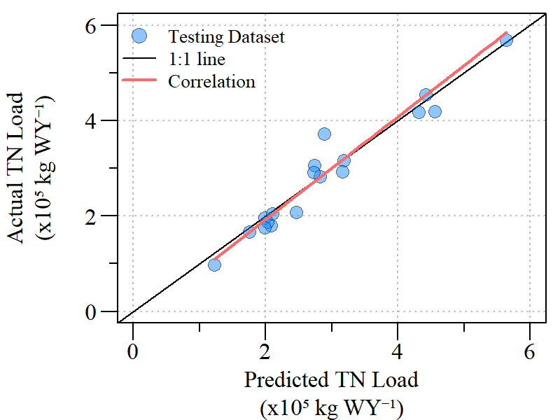
```
Actual versus predicted TN loads at S-79 based on predictive model. Actual and predicted concentration were highly correlated (Spearman’s correlation: r=0.95, $\rho$<0.01).
]

--
exclude: true

.pull-right[

<br>

Model Fit
  - $R^{2}_{adj}$ : 0.94
  - RSE : 326400
  
Train:Test
  - Mean Absolute Percent Error: 9 %
  - Min-Max Accuracy: 92 %

]

???
Mean absolute percentage error - lower the better
Min_Max Accuracy - higher the better

---
name: S79TN_eval2
class: left

### S-79 Water Quality Model (Total Nitrogen)

\begin{align*}
TN Load_{S79} = Q_{C43 Basin} +  Q_{S77} + Mean  Lake  Stage
\end{align*}


.pull-left[
```{r ,fig.align="center"}
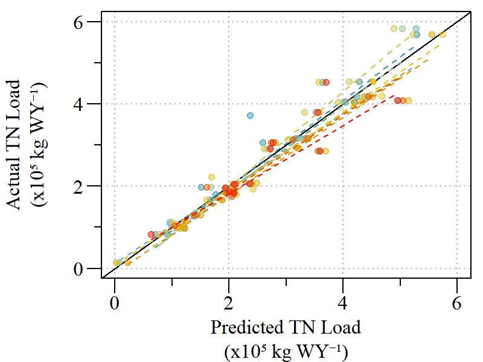
```
Actual versus predicted TN loads at S-79 with each k-model presented. 
]


.pull-right[
k-fold (k=10)

_Cross-validation error (average k errors)_

```{r}
data.frame(source=c(rep("Model",2),rep("Train:Test",2)),Parameter=c("R2adj","RMSE","MAPE","MMA"),
           Mean=c(0.93,376894,11,89),
           Min=c(0.89,324753,7,83),
           Max=c(0.96,411799,19,93))%>%
  flextable()%>%
  font(fontname="Arial",part="all")%>%
  bold(part="header")%>%
  fontsize(size=13,part="header")%>%
  fontsize(size=11,part="body")%>%
  colformat_num(i=2:4,j=3:5,digits=0)%>%
  align(align="left",part="all")%>%
  align(j=3:5,align="center",part="all")%>%
  merge_v(j=1)%>%valign(j=1,valign="top")%>%
  compose(i=1,j=2,as_paragraph("R",as_sup("2"),as_sub("adj")))%>%
  width(width=c(1,1,1,1,1))%>%
  set_header_labels("source"=" ","Per.R2"="Percent of R\u00B2")%>%
  fix_border_issues()%>%
  footnote(i=3:4,j=2,part="body",
           value=as_paragraph(" Mean Absolute Percent Error (MAPE) and Min-Max Accuracy (MMA) expressed in percent"),
           ref_symbols = c(" 1"))

```


]

---
name: S79TN_eval3
class: left

### S-79 Water Quality Model (Total Nitrogen)

\begin{align*}
TN Load_{S79} = Q_{C43 Basin} +  Q_{S77} + Mean  Lake  Stage
\end{align*}

.pull-left[
```{r S79TNrelimp,out.width="70%",fig.align="center"}
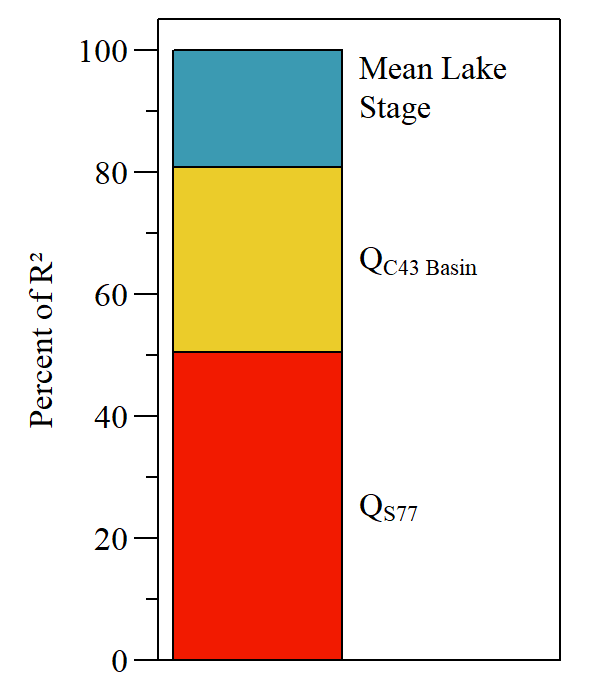
```
Relative importance of each predictor calculated by partitioning R<sup>2</sup> by averaging sequential sums of squares over all orders of regressors (Lindeman et al 1979). All metrics are normalized to a sum of 100%.

]

--
.pull-right[

Relative Importance Metrics for the S79 TN Load annual model. 

```{r}
data.frame(pred=c("QC43","QS77","Stage"),Per.R2=c(39.6,37.9,22.5))%>%
  flextable()%>%
  fontsize(size=14,part="all")%>%
  font(fontname="Arial",part="all")%>%
  hline_top(border = officer::fp_border(width = 1.25))%>%
  hline_bottom(border = officer::fp_border(width = 1.25))%>%
  #hline(border = officer::fp_border(width = 1.25), part = "all")%>%
  align(j=1,align="left",part="all")%>%
  align(j=2,align="center",part="all")%>%
  compose(i=1,j=1,as_paragraph("Q",as_sub("C43")))%>%
  compose(i=2,j=1,as_paragraph("Q",as_sub("S77")))%>%
  compose(i=3,j=1,as_paragraph("Mean Lake Stage"))%>%
  width(width=c(1.75,1.2))%>%
  set_header_labels("pred"="Predictor","Per.R2"="Percent of R\u00B2")%>%
    footnote(i=1,j=2,part="header",
           value=as_paragraph(" Model R\u00B2: 0.94 (Adjusted R\u00B2)"),
           ref_symbols = c(" "))


```
]


---
name: criticalload

### Critical Loads

* The concept of critical loads was proposed as a way to evaluate the modeled loads across alternatives.
  * Janicki (2003)

```{r ,fig.align="center",out.width="70%"}
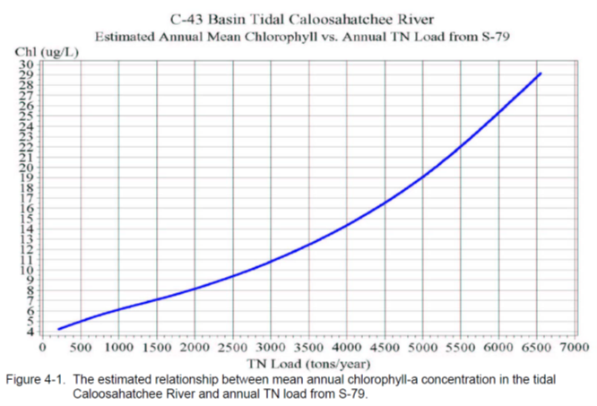
```


---
name: criticalload2

### Critical Loads

* However, when attempting to verify this relationship for purposes of this evaluation the relationship (based on available data) were not congruent with prior efforts (Janicki 2003) or were not consistent with temporal resolution of the models (Doering et al. 2006).
  
```{r ,fig.align="center",out.width="60%"}
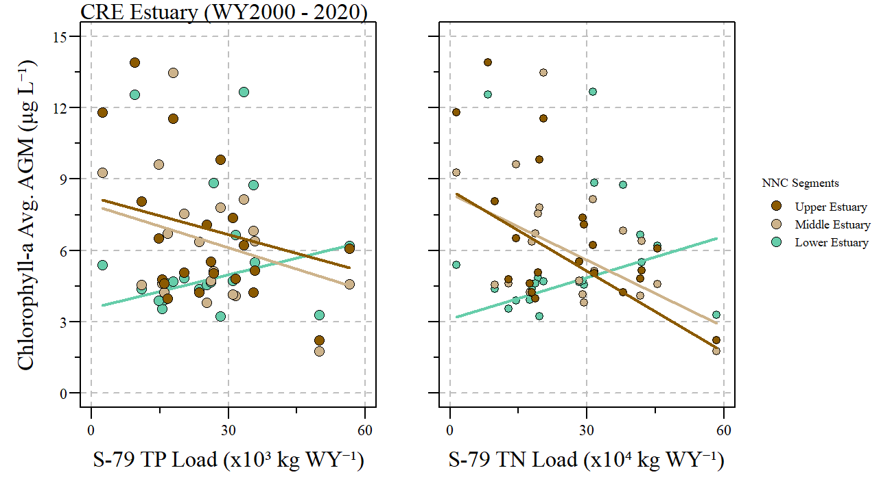
```

.center[S-79 TP and TN annual loads compared to spatially averaged annual geometric mean Chlorophyll-a concentration for each segment.]

* .small[The effects of season, color (CDOM), biology, and hydrodynamics affect the chlorophyll-load relationship across the estuary.]

* .small[Using Lower Estuary Chl-a WQS critical could be ~4262 tons TN & ~434 tons TP. ]

???
CRE TN TMDL = 4121 mt

---
name: LOSOM

### Application of Models

```{r ,fig.align="center",out.width="65%",fig.cap="Predicted TN and TP loads for existing condition (ECB19), no-action (NA25f) and prefered alterantive (PA25) for S-79 during period of simulation for LOSOM."}
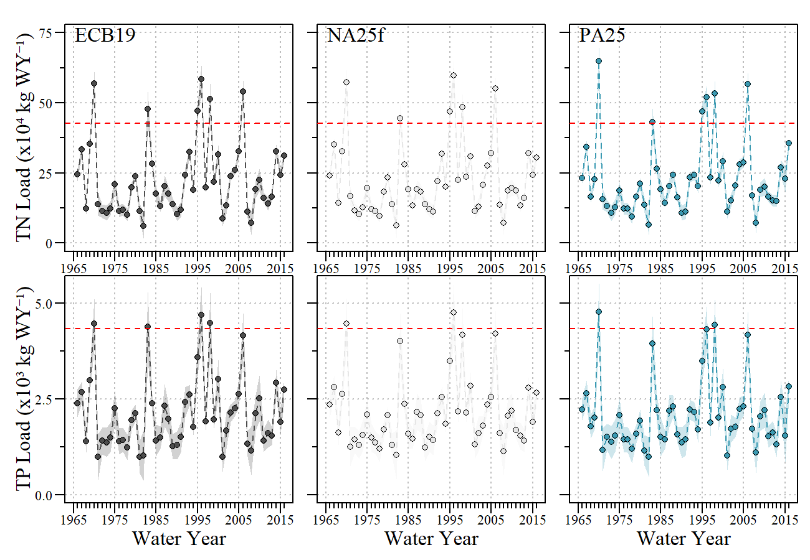
```

.small[
**% Difference to FWO (NA25f vs PA25)**
.pull-left[
* TP Load: -3.4%
* TN Load: -0.5% 
  ]
.pull-right[
* TP FWM: -4.1%
* TN FWM: -0.04% 
]
]
---
name: conclusion

### Conclusion

* Total annual nutrient load models were developed to evaluate changes in water management and the potential effect to downstream waters.
  * Presented to LOSOM PDT 

* Critical nutrient loads combined with predicted loads provides a means of assess ecological impact due to nutrient loading.
  * *Needs further development*
  
* Applied to the Lake Okeechobee System Operating Manual (LOSOM) scenario evaluation.

* Dove-tails with other ongoing work. 
  * CRE Optical Model development and evaluation
  * WRTDS evaluation of estuarine water quality

---
name: References

### References
.small[
* Chen Z, Doering PH, Ashton M, Orlando BA (2015) Mixing Behavior of Colored Dissolved Organic Matter and Its Potential Ecological Implication in the Caloosahatchee River Estuary, Florida. Estuaries and Coasts 38:1706–1718.

* Coles R, McKenzie L, Rasheed M, et al (2007) Status and Trends of Seagrass Habitats in the Great Barrier Reef World Heritage Area. Reef and Rainforest Research Centre Limited, Cairns, Australia

* Doering PH, Chamberlain RH, Haunert KM (2006) Chlorophyll-a and its use as an indicator of eutrophication in the Caloosahatchee Estuary, Florida. Florida Scientist 69:51–72.

* Enfield DB, Mestas-Nuñez AM, Trimble PJ (2001) The Atlantic Multidecadal Oscillation and its relation to rainfall and river flows in the continental U.S. Geophysical Research Letters 28:2077–2080.

* Glibert PM, Allen JI, Bouwman AF, et al (2010) Modeling of HABs and eutrophication: Status, advances, challenges. Journal of Marine Systems 83:262–275.

* Janicki Environmental (2003) Development of Critical Loads for the C-43 Basin, Caloosahatchee River. Florida Department of Environmental Protection, Tallahassee, FL

* Julian P, Osborne TZ (2018) From lake to estuary, the tale of two waters: A study of aquatic continuum biogeochemistry. Environment Monitoring and Assessment 190:1–24. 

* Madden CJ, Rudnick DT, McDonald AA, et al (2009) Ecological indicators for assessing and communicating seagrass status and trends in Florida Bay. Ecological Indicators 9:S68–S82. 
]

---
class: inverse

---
name: hurricanes
class: left

- Annual TP and TN loads were estimated by interpolating water quality concentration daily from grab samples collected at each respective structure during days of observed flow (consistent with SFWMD Nutrient Load Program). 
  - Period of Record was restricted to WY 1982 – 2019.

```{r hurricane map,out.width="80%",fig.align="center"}
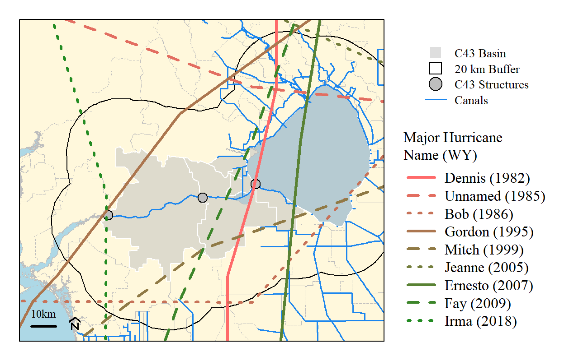
```

---
name: TP_diag


**S79 TP Model diagnostics**

.pull-left[

```{r ,fig.align="center"}
knitr::include_graphics('./plots/S79_TPModel_diag.png')
```
.small[S79 TP model diagnostics plots (Top Left: Residuals vs Fitted, Bottom Left: Normal Q-Q, Top Right: Scale-Location, Bottom right: Residuals vs leverage.).]

.small[

- GVLMA (Global Stats = 3.36, $\rho$ =0.50)

- Shapiro-Wilk normality test (W=0.92, $\rho$ =0.05)


]

]

.pull-right[

```{r ,out.width="100%",fig.align="center"}
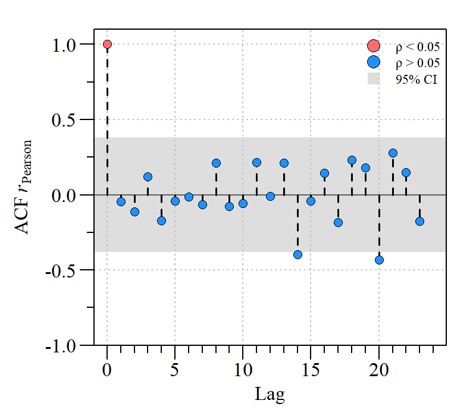
```
.small[S79 TP Model residual Autocorrelation Function.]
<br>

.small[

- Breusch-Godfrey (LM test = 0.06, df = 1, $\rho$=0.80)

]

]

.footnote[
.small[[TP Model](#S79TPMod) plots]
]

---
name: TN_diag


**S79 TN Model diagnostics**

.pull-left[

```{r ,fig.align="center"}
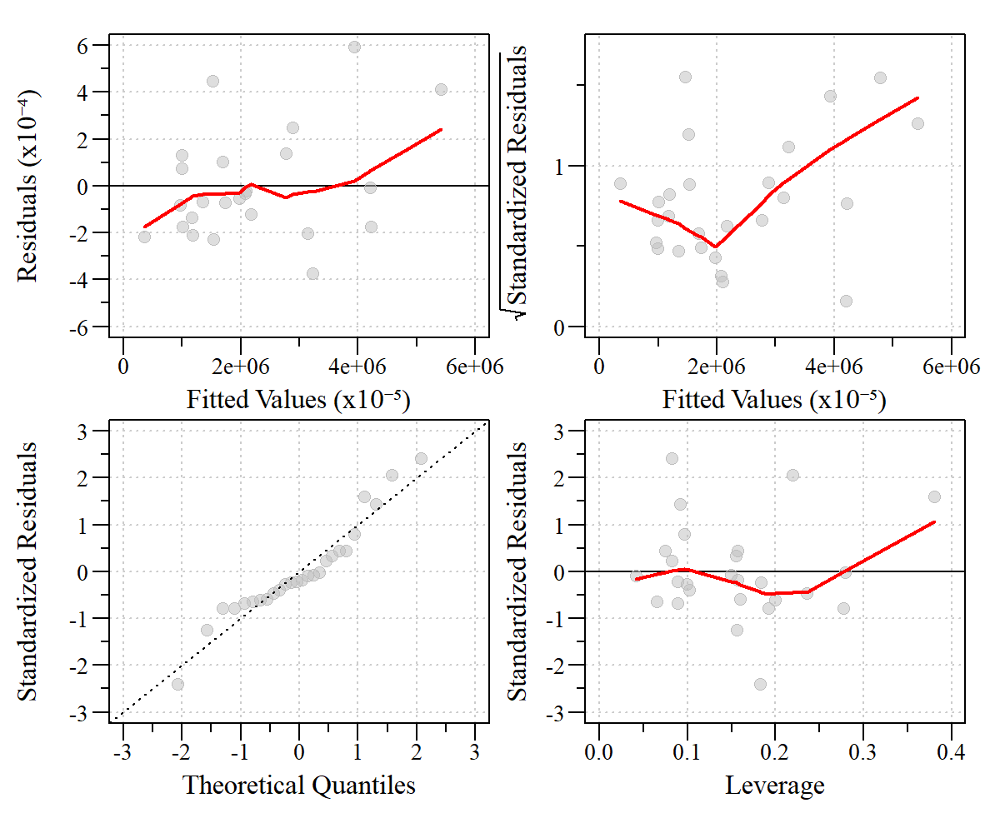
```
.small[S79 TN model diagnostics plots (Top Left: Residuals vs Fitted, Bottom Left: Normal Q-Q, Top Right: Scale-Location, Bottom right: Residuals vs leverage.).]

.small[

- GVLMA (Global Stats = 6.25, $\rho$ =0.18)

- Shapiro-Wilk normality test (W=0.94, $\rho$ =0.12)

]

]

.pull-right[

```{r ,out.width="100%",fig.align="center"}
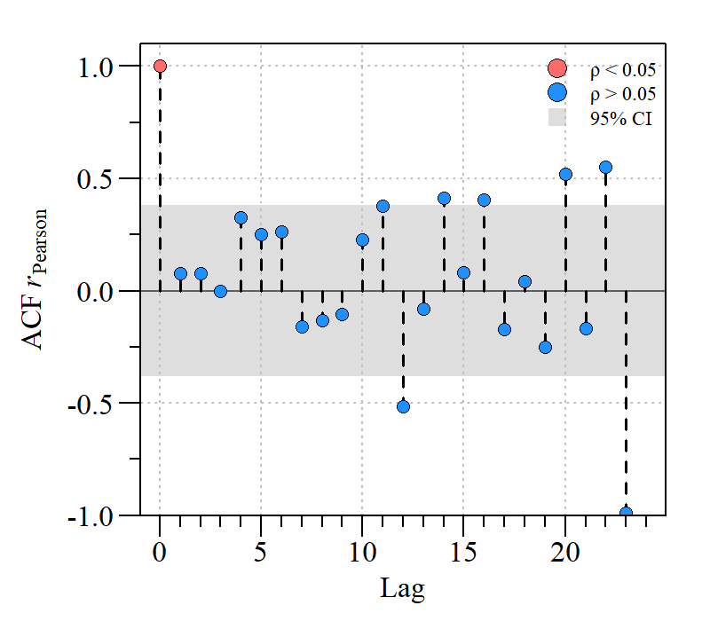
```
.small[S79 TN Model residual Autocorrelation Function.]
<br>

.small[

- Breusch-Godfrey (LM test = 0.19, df = 1, $\rho$=0.66)

]

]

.footnote[
.small[[TN Model](#S79TNMod) plots]
]
